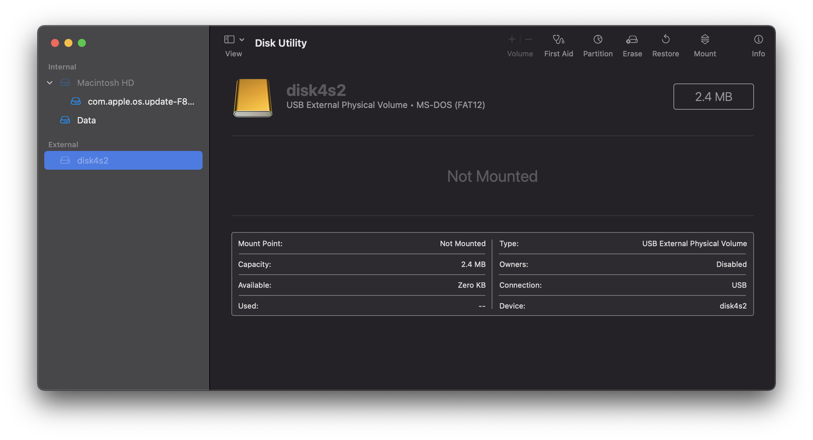
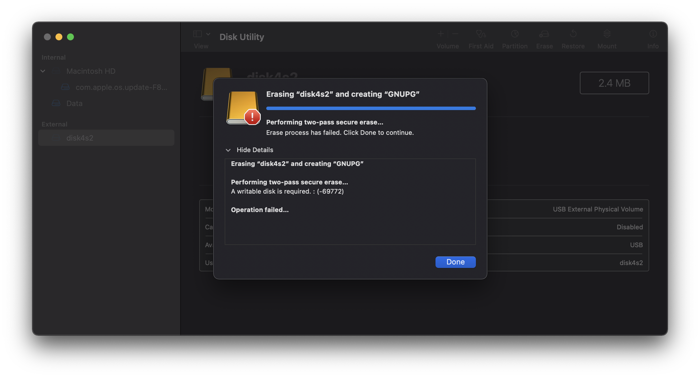
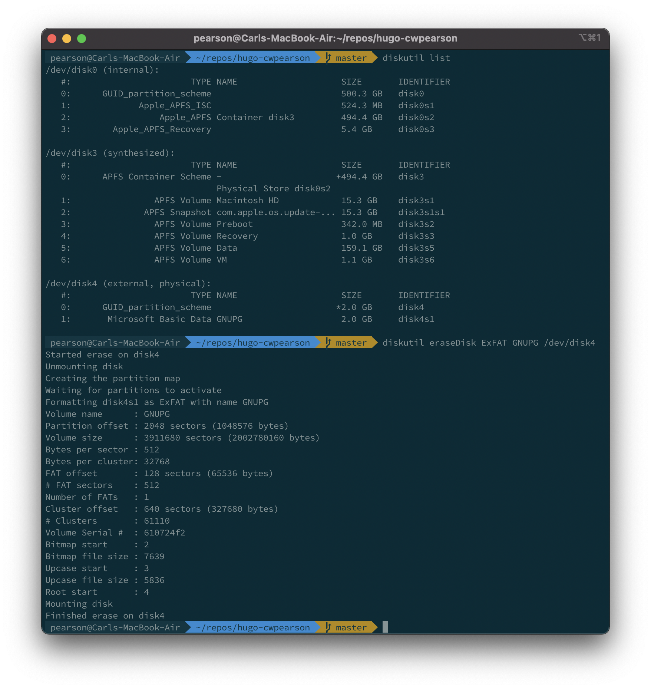

+++
title = "Formatting MacOS Disk on Command Line"
date = 2021-08-01T00:00:00
lastmod = 2021-08-01T00:00:00
draft = false

# Authors. Comma separated list, e.g. `["Bob Smith", "David Jones"]`.
authors = ["Carl Pearson"]

tags = []

summary = "What to do when Disk Utility won't"

# Projects (optional).
#   Associate this post with one or more of your projects.
#   Simply enter your project's folder or file name without extension.
#   E.g. `projects = ["deep-learning"]` references 
#   `content/project/deep-learning/index.md`.
#   Otherwise, set `projects = []`.
projects = []

# Featured image
# To use, add an image named `featured.jpg/png` to your project's folder. 
[image]
  # Caption (optional)
  caption = ""

  # Focal point (optional)
  # Options: Smart, Center, TopLeft, Top, TopRight, Left, Right, BottomLeft, Bottom, BottomRight
  focal_point = "Center"

  # Show image only in page previews?
  preview_only = true

categories = []

# Set captions for image gallery.

+++

For reasons beyond my comprehension, macOS's Disk Utility randomly won't format external drives.

For example, here's what disk utility shows when I first plug in the flash drive.

Here's the error when I try to format it as ExFAT.

Instead, use the `diskutil` command to first `list` the disks to find out which one is the offending disk `disk4` in this case) and then reformat it with something like `diskutil eraseDisk [format] [name] [disk]`.

