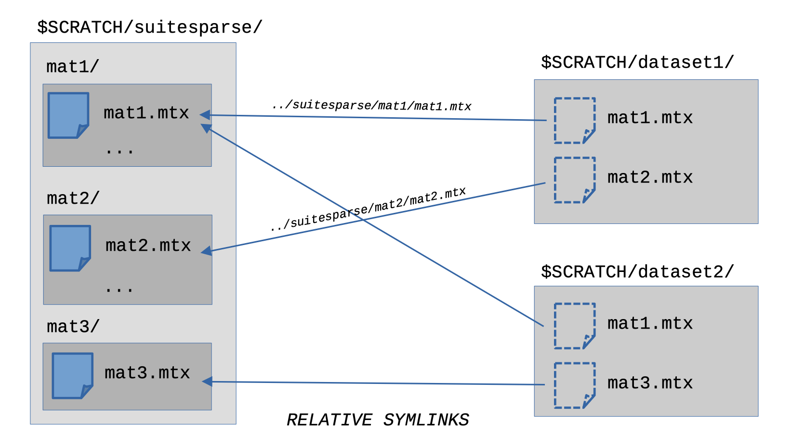

+++
title = "SuiteSparse Collection Downloader"
date = 2021-12-01T00:00:00
lastmod = 2021-12-01T00:00:00
draft = false

# Authors. Comma separated list, e.g. `["Bob Smith", "David Jones"]`.
authors = ["Carl Pearson"]

tags = []

summary = ""

# Projects (optional).
#   Associate this post with one or more of your projects.
#   Simply enter your project's folder or file name without extension.
#   E.g. `projects = ["deep-learning"]` references 
#   `content/project/deep-learning/index.md`.
#   Otherwise, set `projects = []`.
projects = []

# Featured image
# To use, add an image named `featured.jpg/png` to your project's folder. 
[image]
  # Caption (optional)
  caption = ""

  # Focal point (optional)
  # Options: Smart, Center, TopLeft, Top, TopRight, Left, Right, BottomLeft, Bottom, BottomRight
  focal_point = "Center"

  # Show image only in page previews?
  preview_only = true

categories = []

# Set captions for image gallery.

+++

One of the resources I use to evaluate sparse-matrix vector multiplication (SpMV) performance at Sandia National Labs is the [SuiteSparse Collection](https://sparse.tamu.edu/).
The performance of SpMV depends on the spare matrix structure, and the SuiteSparse Collection offers a wide population of matrices to test with.
It is not generally the case that a new SpMV implementation will be an improvement across all matrices.
While it would be better were this so, it is also the case that particular applications feature particular matrix structures, and therefore are satisfied with an SpMV appropriate to those specific structures.

The matrices in the SuiteSparse Collection are tagged with a lot of metadata: information about their size, what problem they come from, the non-zero datatype, and so forth.
This provides many dimensions to divide the collection along while evaluating performance, or may ways in which a particular subset of the collection can be created.

[suitesparse-downloader](https://github.com/cwpearson/suitesparse-downloader) is a python tool I created to help manage different subsets of the SuiteSparse Collection.
It is built around [ssgetpy](https://github.com/drdarshan/ssgetpy), a python interface to the metadata attached to the SuiteSparse Collection matrices.
ssgetpy works by parsing https://sparse.tamu.edu/files/ssstats.csv and building a local database, which it queries.
ssgetpy also provides some methods to download SuiteSparse Collection matrices.

suitesparse-downloader defines several subsets of the suitesparse collection.
These subsets represent various filters applied to the entire suitesparse collection.
suitesparse-downloader puts each of these subsets in its own directory.
To prevent duplicating the download of any matrix common to two subsets, only one canonical copy of any given matrix is downloaded.
In the subset directories, the matrix files are relative symlinks to the canonical copy.

This figure shows an example of two subsets, `dataset1` and `dataset2`.
Each consists of two matrices, but `mat1.mtx` is only downloaded once, and both datasets use a relative symlink to the same file.
The use of relative symlinks means the directories can be copied to another system and the symlinks are maintained as long as the relative positions of the `suitesparse` and dataset directories is maintained.