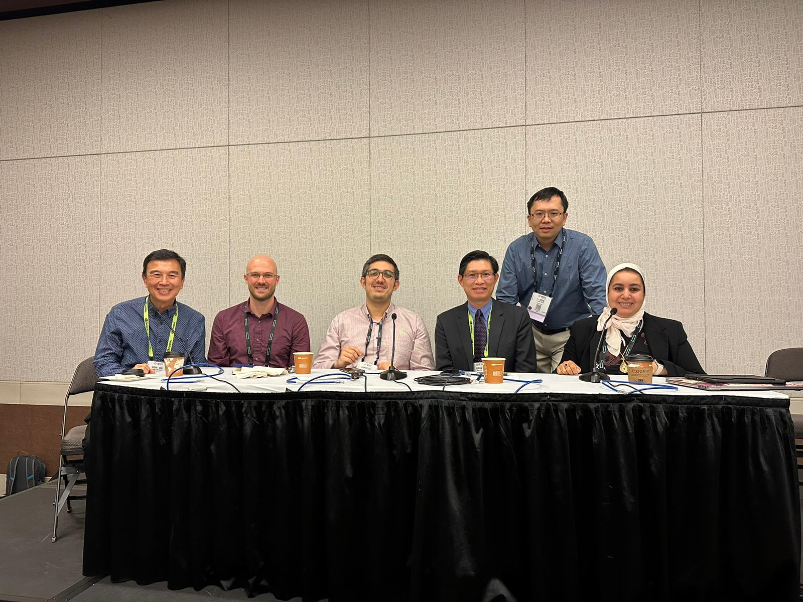

+++
title = "Composable Systems Opportunities and Challenges"
date = 2022-11-15T00:00:00
lastmod = 2022-11-16T00:00:00
draft = false

# Authors. Comma separated list, e.g. `["Bob Smith", "David Jones"]`.
authors = ["Carl Pearson"]

tags = []

summary = ""

# Projects (optional).
#   Associate this post with one or more of your projects.
#   Simply enter your project's folder or file name without extension.
#   E.g. `projects = ["deep-learning"]` references 
#   `content/project/deep-learning/index.md`.
#   Otherwise, set `projects = []`.
projects = []

# Featured image
# To use, add an image named `featured.jpg/png` to your project's folder. 
[image]
  # Caption (optional)
  caption = ""

  # Focal point (optional)
  # Options: Smart, Center, TopLeft, Top, TopRight, Left, Right, BottomLeft, Bottom, BottomRight
  focal_point = "Center"

  # Show image only in page previews?
  preview_only = false

categories = []

# Set captions for image gallery.

+++

I'm a panelist on the "Composable Systems Opportunities and Challenges" panel at SC'22, with my colleagues Christian Pinto and Kaotar El Maghraoui from IBM Research, the CEO and founder of H3 systems Brian Pan and my Ph.D advisor Wen-Mei Hwu of Nivida.
The panel is moderated by I-Hsin Chung of IBM research.

The panel is in C147 at the Kay Bailey Hutchinson Convention Center at 10:30am, Tuesday 11/15/22.

From left to right: Wen-Mei Hwu (Nvidia), me, Christian Pinto (IBM), Brian Pan (H3 Platform), I-Hsin Chung (IBM), and Kaoutar El Maghraoui (IBM).

