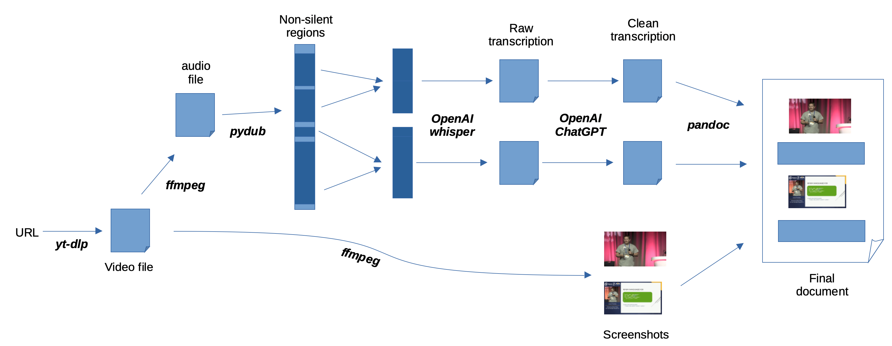

+++
title = "Transcribing Videos with OpenAI's Whisper and ChatGPT"
date = 2023-03-03T00:00:00
lastmod = 2023-03-06T00:00:00
draft = false

# Authors. Comma separated list, e.g. `["Bob Smith", "David Jones"]`.
authors = ["Carl Pearson"]

tags = []

summary = "Transcribing Videos with OpenAI's Whisper and ChatGPT (and yt-dlp and ffmpeg and pydub and imagehash and pandoc)"

# Projects (optional).
#   Associate this post with one or more of your projects.
#   Simply enter your project's folder or file name without extension.
#   E.g. `projects = ["deep-learning"]` references 
#   `content/project/deep-learning/index.md`.
#   Otherwise, set `projects = []`.
projects = []

# Featured image
# To use, add an image named `featured.jpg/png` to your project's folder. 
[image]
  # Caption (optional)
  caption = ""

  # Focal point (optional)
  # Options: Smart, Center, TopLeft, Top, TopRight, Left, Right, BottomLeft, Bottom, BottomRight
  focal_point = "Center"

  # Show image only in page previews?
  preview_only = false


categories = []

# Set captions for image gallery.


+++


At $0.006/min and $0.0002/1k tokens, OpenAI's Whisper and ChatGPT APIs are cheap enough to play with.
I developed a "video-to-pdf" transcription system for recorded talks to learn more about them.
Let's do some back-of-the-envelope calculations about this hypothetical system.
It has two pieces - OpenAI's Whisper for the speech-to-text, and then OpenAI's ChatGPT to clean up any transcription errors and break the text into paragraphs.

A fast english speaker reaches around [160 words per minute](https://virtualspeech.com/blog/average-speaking-rate-words-per-minute).
OpenAI says each word is about 0.75 tokens for standard english, meaning our hypothetical fast, non-stop speaker is generating 120 tokens per minute, or 7200 per hour.
If we had to pass those through ChatGPT, (one token out for each token in), we would get the following costs:

| API     | Cost               | Cost for 1 hour of speech |
|---------|--------------------|---------------------------|
| Whisper | $0.006 / min       | 36 cents                  |
| ChatGPT | $0.002 / 1k tokens | 2.88 cents                | 

ChatGPT is basically free - Whisper is 30x as expensive -- but the whole thing still comes out to less than $0.50 to transcribe an hour of speech.

## High-Level Design



The high level design is

1. Use [yt-dlp](https://github.com/yt-dlp/yt-dlp) to download a talk from Youtube.
2. Use [FFmpeg](https://github.com/FFmpeg/FFmpeg) to extract the audio from the video
3. Use [pydub](https://github.com/jiaaro/pydub) to detect non-silent regions of audio
4. Use [OpenAI's Whisper](https://platform.openai.com/docs/guides/speech-to-text) to transcribe the audio
5. Use [OpenAI's ChatGPT](https://platform.openai.com/docs/guides/chat) to clean up the text
6. Use [FFmpeg](https://github.com/FFmpeg/FFmpeg) again to extract frames from the talk
6. Use [Pandoc](https://github.com/jgm/pandoc) to stitch the text and frames together into a summary document

## Acquiring the Source Video and Audio

If you don't already have access to a talk, consider something like [yt-dlp](https://github.com/yt-dlp/yt-dlp), which will allow you to download video from most websites, including Youtube.
Then, I use [ffmpeg](https://github.com/FFmpeg/FFmpeg) to exctact the audio track from the video.

```bash
ffmpeg -i input.mp4 -map 0:a output.mp3
```

This audio track will be provided to OpenAI's Whipser API.

## Avoiding Partial Words

OpenAI's Whisper has a 25 MiB limit (at least for the time being).
Therefore, long audio tracks need to be split into chunks of at most 25 MiB.


If we're not smart about where we split audio, we might end up cutting a word in half, which will limit the accuracy off the Whisper API transcription on those words.
We'd rather make shorter chunks that are split when there is silence in the video.
From a monetary cost perspective, it actually doesn't matter how short the chunks are -- OpenAI is billing us for each second of audio and for each word processed by ChatGPT.
Regardless of how short the chunks are, the total audio length and words processed by ChatGPT are the same.

## ChatGPT's Context Size

The most pressing limit is ChatGPT's limit context: around 4k tokens.
For our purposes, we expect to generate slightly more than one output token for each input token, since ChatGPT will be asked to reproduce the input text with added paragraph breaks.
This means our input is limited to around 2000 tokens per API call.
At 120 tokens per minute, we'd expect to reach that limit after 15 minutes.
In practice, ChatGPT has a hard time reproducing text that is 2000 tokens, so I use a 5-minute window instead of fifteen minutes.


## Splitting Audio

To (attempt to) avoid splitting words, I use [pydub](https://github.com/jiaaro/pydub) to detect silence.
I arbitrarily pick a silence threshold, and relax that threshold until no noisy region is longer than our 5-minute chunk.
That means there is (hopefully) some safe place to split the text at least every five minutes.

This leaves many very short audio segments.
OpenAI says Whisper does better with as much context as possible, so I greedily recombine smaller audio chunks into segments no longer than five minutes.
Combine them largest-to-smallest, which allows the smallest ones a best chance to be squeezed in beside their larger neighbors.
These recombined chunks may have some silent regions within them - that's fine.
The only downside is you pay OpenAI to transcribe nothing out of these silent regions.

## Generating Text

Each five-minute audio file is provided to OpenAI's Whisper API.
The resulting text is unformatted, with no metadata, but does have punctuation.
I then pass it to ChatGPT with the following prompt:

> System:
> You split text into paragraphs and correct transcription errors

> User:
> Split the following text into paragraphs WITHOUT adding or removing anything:\n{text}

ChatGPT is quite good at splitting this unformatted text into paragraphs.
I also considered the breaks between the five-minute chunks to be paragraph breaks, which works fine in practice since there was a silent pause there anyway.

## Generating Screenshots

The final ingredient needed is a screencapture of the video to go along with each paragraph.
I know what timestamp is associated with each five-minute chunk, and I can look up where among the five-minute chunks each paragraph came from.
The source chunk and location within the chunk gives a very accurate timestamp for each paragraph of text.
I use [ffmpeg](https://github.com/FFmpeg/FFmpeg) to extract a frame from the video for each paragraph.

```bash
ffmpeg -y -ss 01:23:45 -i input.webm -frames:v 1 -q:v 2 output.jpg
```

## The Final Summary

A markdown document is generated by inserting each paragraph in turn.
A screenshot is inserted as well, *unless* it is too similar to the last inserted screenshot.
This happens when the speaker lingers on a slide for a while, generating a lot of text without changing the video much.
Finally, I use [Pandoc](https://github.com/jgm/pandoc) to convert that markdown file into a PDF.

## Image Similarity

How do I decide whether a frame is "too similar" to a previous frame?
I experimented with a few options and settled on the `dhash` function in `imagehash`.
A description of dhash is provided [here](https://web.archive.org/web/20230301000000*/https://www.hackerfactor.com/blog/index.php?/archives/529-Kind-of-Like-That.html).

In short, the difference hash works like this:
* Image is reduced to 9x8 (72 pixels) and grayscale.
* Compute pixel differences within rows, yeilding 8x8 grid of differences
* Each of 64 bits in the hash is set if the left pixel is brighter than the right pixel
* The distance between two hashes is the hamming distance - the number of bits changed.

For my purposes, we want to call *some* small variation in frames "the same", since many videos of talks have a small overlay of the presenter speaking.
However, we don't want to be too liberal, since it's also common for slides to change only incrementally as a concept is explained.
I settled on a difference of 1 bit as providing a reasonable test.
If the overlay of the speaker is too large, this doesn't work quite as well, but I'd rather include extra images in the output rather than too few.
