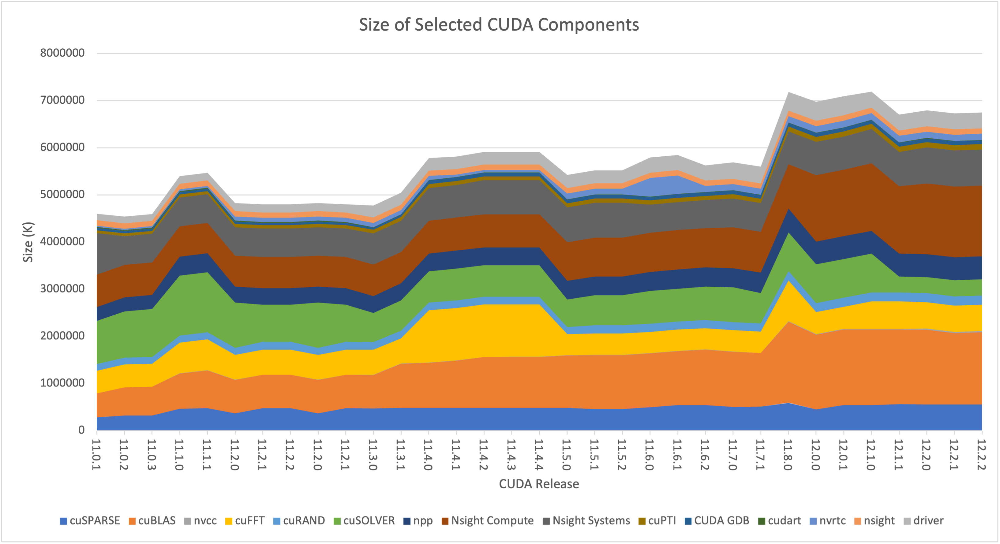
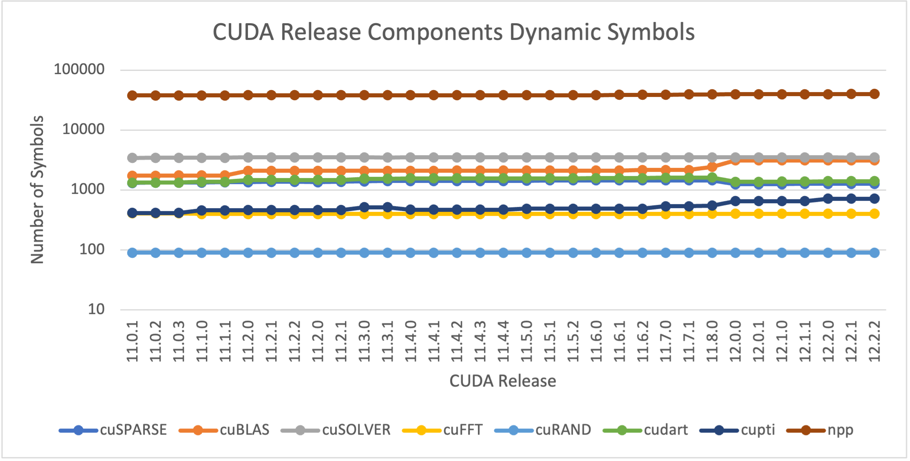

+++
title = "CUDA Releases: Component Versions and Sizes"
description = "The sizes and versions of libraries and other components in each CUDA release"
keywords = ["versions", "shared library"]
date = 2023-10-23T00:00:00
lastmod = 2024-04-29T00:00:00
draft = false
authors = ["Carl Pearson"]
tags = ["CUDA", "cuSPARSE"]
summary = ""
projects = []
categories = []
css = """
th, td {
  padding-left: 0.5em;
  padding-right: 0.5em;
  white-space: nowrap;
  text-align: center;
}
"""
+++

While I was working on something else, I stumbled across a PR in Trilinos that referenced a problem in how Kokkos Kernels handles cuSPARSE.

* https://github.com/trilinos/Trilinos/pull/12238

The basic problem is that the cuSPARSE version does not necessarily match the CUDA release version.
This means that the cuSPARSE API sometimes changes on a patch release of CUDA.
Furthermore, the cuSPARSE release that comes with each CUDA release is not documented anywhere, as far as I can tell.
In Kokkos Kernels, we were using the CUDA release version to detect whether certain cuSPARSE APIs were available, which is wrong, and we were also setting the wrong release threshold.

* [kokkos-kernels/issues/1967](https://github.com/kokkos/kokkos-kernels/issues/1967)

I made two PRs to fix the problem for cusparseSpMV and cusparseSpMM functions.

* [kokkos-kernels/pull/2011](https://github.com/kokkos/kokkos-kernels/pull/2011)
* [kokkos-kernels/pull/2012](https://github.com/kokkos/kokkos-kernels/pull/2012)

For future reference, here are the cuSPARSE versions that correspond to each CUDA release:

## CUDA 12

<table>
<tr><th>CUDA Release</th><th>cuSPARSE</th><th>cuBLAS</th><th>cuSOLVER</th><th>cuFFT</th></tr>
<tr><td>12.4.1</td><td>12.3.1.170</td><td>12.4.5.8</td><td>11.6.1.9</td><td>11.2.1.3</td></tr>
<tr><td>12.3.2</td><td>12.2.0.103</td><td>12.3.4.1</td><td>11.5.4.101</td><td>11.0.12.1</td></tr>
<tr><td>12.3.1</td><td>12.2.0.103</td><td>12.3.4.1</td><td>11.5.4.101</td><td>11.0.12.1</td></tr>
<tr><td>12.3.0</td><td>12.1.3.153</td><td>12.3.2.9</td><td>11.5.3.52</td><td>11.0.11.19</td></tr>
<tr><td>12.2.2</td><td>12.1.2.141</td><td>12.2.5.6</td><td>11.5.2.141</td><td>11.0.8.103</td></tr>
<tr><td>12.2.1</td><td>12.1.2.129</td><td>12.2.4.5</td><td>11.5.1.129</td><td>11.0.8.91</td></tr>
<tr><td>12.2.0</td><td>12.1.1.53</td><td>12.2.1.16</td><td>11.5.0.53</td><td>11.0.8.15</td></tr>
<tr><td>12.1.1</td><td>12.1.0.106</td><td>12.1.3.1</td><td>11.4.5.107</td><td>11.0.2.54</td></tr>
<tr><td>12.1.0</td><td>12.0.2.55</td><td>12.1.0.26</td><td>11.4.4.55</td><td>11.0.2.4</td></tr>
<tr><td>12.0.1</td><td>12.0.1.140</td><td>12.0.2.224</td><td>11.4.3.1</td><td>11.0.1.95</td></tr>
<tr><td>12.0.0</td><td>12.0.0.76</td><td>12.0.1.189</td><td>11.4.2.57</td><td>11.0.0.21</td></tr>
</table>

## CUDA 11

<table>
<tr><th>CUDA Release</th><th>cuSPARSE</th><th>cuBLAS</th><th>cuSOLVER</th><th>cuFFT</th></tr>
<tr><td>11.0.1</td><td>11.0.0.191</td><td>11.0.0.191</td><td>10.4.0.191</td><td>10.1.3.191</td></tr>
<tr><td>11.0.2</td><td>11.1.0.218</td><td>11.1.0.229</td><td>10.5.0.218</td><td>10.2.0.218</td></tr>
<tr><td>11.0.3</td><td>11.1.1.245</td><td>11.2.0.252</td><td>10.6.0.245</td><td>10.2.1.245</td></tr>
<tr><td>11.1.0</td><td>11.2.0.275</td><td>11.2.1.74</td><td>11.0.0.74</td><td>10.3.0.74</td></tr>
<tr><td>11.1.1</td><td>11.3.0.10</td><td>11.3.0.106</td><td>11.0.1.105</td><td>10.3.0.105</td></tr>
<tr><td>11.2.0</td><td>11.3.1.68</td><td>11.3.1.68</td><td>11.0.2.68</td><td>10.4.0.72</td></tr>
<tr><td>11.2.1</td><td>11.4.0.135</td><td>11.4.1.1026</td><td>11.1.0.135</td><td>10.4.0.135</td></tr>
<tr><td>11.2.2</td><td>11.4.1.1152</td><td>11.4.1.1043</td><td>11.1.0.152</td><td>10.4.1.152</td></tr>
<tr><td>11.2.0</td><td>11.3.1.68</td><td>11.3.1.68</td><td>11.0.2.68</td><td>10.4.0.72</td></tr>
<tr><td>11.2.1</td><td>11.4.0.135</td><td>11.4.1.1026</td><td>11.1.0.135</td><td>10.4.0.135</td></tr>
<tr><td>11.3.0</td><td>11.5.0.58</td><td>11.4.2.10064</td><td>11.1.1.58</td><td>10.4.2.58</td></tr>
<tr><td>11.3.1</td><td>11.6.0.109</td><td>11.5.1.109</td><td>11.1.2.109</td><td>10.4.2.109</td></tr>
<tr><td>11.4.0</td><td>11.6.0.43</td><td>11.5.2.43</td><td>11.2.0.43</td><td>10.5.0.43</td></tr>
<tr><td>11.4.1</td><td>11.6.0.100</td><td>11.5.4.8</td><td>11.2.0.100</td><td>10.5.1.100</td></tr>
<tr><td>11.4.2</td><td>11.6.0.120</td><td>11.6.1.51</td><td>11.2.0.120</td><td>10.5.2.100</td></tr>
<tr><td>11.4.3</td><td>11.6.0.120</td><td>11.6.5.2</td><td>11.2.0.120</td><td>10.5.2.100</td></tr>
<tr><td>11.4.4</td><td>11.6.0.120</td><td>11.6.5.2</td><td>11.2.0.120</td><td>10.5.2.100</td></tr>
<tr><td>11.5.0</td><td>11.7.0.31</td><td>11.7.3.1</td><td>11.2.1.48</td><td>10.6.0.54</td></tr>
<tr><td>11.5.1</td><td>11.7.0.107</td><td>11.7.4.6</td><td>11.3.2.107</td><td>10.6.0.107</td></tr>
<tr><td>11.5.2</td><td>11.7.0.107</td><td>11.7.4.6</td><td>11.3.2.107</td><td>10.6.0.107</td></tr>
<tr><td>11.6.0</td><td>11.7.1.55</td><td>11.8.1.74</td><td>11.3.2.55</td><td>10.7.0.55</td></tr>
<tr><td>11.6.1</td><td>11.7.2.112</td><td>11.8.1.74</td><td>11.3.3.112</td><td>10.7.1.112</td></tr>
<tr><td>11.6.2</td><td>11.7.2.124</td><td>11.9.2.110</td><td>11.3.4.124</td><td>10.7.2.124</td></tr>
<tr><td>11.7.0</td><td>11.7.3.50</td><td>11.10.1.25</td><td>11.3.5.50</td><td>10.7.2.50</td></tr>
<tr><td>11.7.1</td><td>11.7.4.91</td><td>11.10.3.66</td><td>11.4.0.1</td><td>10.7.2.91</td></tr>
<tr><td>11.8.0</td><td>11.7.5.86</td><td>11.11.3.6</td><td>11.4.1.48</td><td>10.9.0.58</td></tr>
</table>

### CUDA 10

In the CUDA 10 releases, the versions are programmatically accessible through a library call rather than being defined in the headers, so I couldn't just grep them out of the installation.

## Release Component Sizes

Since I had to download every single CUDA release to extract this information, I was curious about how the releases have evolved over time.

* total size: the size of the extracted installer (including the shipped driver)
* `nvcc` size: the size of the actual `nvcc` binary
* other component sizes: 
  * 11/12: the size of the corresponding directory in the installer (including headers, man pages, whatever else Nvidia ships for that library in the installer)
  * 10: the size of the `.so` files for that library, or the size of the component directory in the install

### CUDA 12

<table>
<tr><th>CUDA Release</th><th>Size (K)</th><th>cuSPARSE Size</th><th>cuBLAS Size</th><th>nvcc Size</th><th>cuFFT Size</th><th>cuRAND Size</th><th>cuSOLVER Size</th><th>npp Size</th><th>Nsight Compute</th><th>Nsight Systems</th><th>cuPTI Size</th><th>CUDA GDB Size</th><th>cudart Size</th><th>nvrtc Size</th><th>nsight Size</th><th>driver Size</th></tr>
<tr><td>12.4.1</td><td>7588644</td><td>582172 (7.67&#37)</td><td>1396132 (18.39&#37)</td><td>22144 (.29&#37)</td><td>921144 (12.13&#37)</td><td>190708 (2.51&#37)</td><td>352052 (4.63&#37)</td><td>497568 (6.55&#37)</td><td>1395692 (10.41&#37)</td><td>790260 (18.39&#37)</td><td>115456 (1.52&#37)</td><td>57108 (.75&#37)</td><td>7696 (.10&#37)</td><td>151244 (1.99&#37)</td><td>115900 (1.52&#37)</td><td>299672 (3.94&#37)</td></tr>
<tr><td>12.3.2</td><td>7482692</td><td>554300 (7.40&#37)</td><td>1540360 (20.58&#37)</td><td>21276 (.28&#37)</td><td>564224 (7.54&#37)</td><td>190192 (2.54&#37)</td><td>343268 (4.58&#37)</td><td>504648 (6.74&#37)</td><td>1535344 (10.49&#37)</td><td>785304 (20.51&#37)</td><td>111948 (1.49&#37)</td><td>79564 (1.06&#37)</td><td>7624 (.10&#37)</td><td>145820 (1.94&#37)</td><td>115904 (1.54&#37)</td><td>317220 (4.23&#37)</td></tr>
<tr><td>12.3.1</td><td>7482712</td><td>554304 (7.40&#37)</td><td>1540360 (20.58&#37)</td><td>21276 (.28&#37)</td><td>564228 (7.54&#37)</td><td>190192 (2.54&#37)</td><td>343268 (4.58&#37)</td><td>504648 (6.74&#37)</td><td>1535352 (10.49&#37)</td><td>785304 (20.51&#37)</td><td>111948 (1.49&#37)</td><td>79564 (1.06&#37)</td><td>7624 (.10&#37)</td><td>145820 (1.94&#37)</td><td>115904 (1.54&#37)</td><td>317224 (4.23&#37)</td></tr>
<tr><td>12.3.0</td><td>7458604</td><td>548472 (7.35&#37)</td><td>1537560 (20.61&#37)</td><td>21280 (.28&#37)</td><td>564228 (7.56&#37)</td><td>190192 (2.54&#37)</td><td>343272 (4.60&#37)</td><td>489568 (6.56&#37)</td><td>1534960 (10.52&#37)</td><td>785308 (20.57&#37)</td><td>111932 (1.50&#37)</td><td>79552 (1.06&#37)</td><td>7624 (.10&#37)</td><td>145820 (1.95&#37)</td><td>115908 (1.55&#37)</td><td>317220 (4.25&#37)</td></tr>
<tr><td>12.2.2</td><td>7394064</td><td>551892 (7.46&#37)</td><td>1536844 (20.78&#37)</td><td>20784 (.28&#37)</td><td>562828 (7.61&#37)</td><td>191372 (2.58&#37)</td><td>342780 (4.63&#37)</td><td>489096 (6.61&#37)</td><td>1503072 (10.36&#37)</td><td>766144 (20.32&#37)</td><td>110996 (1.50&#37)</td><td>79356 (1.07&#37)</td><td>7456 (.10&#37)</td><td>134212 (1.81&#37)</td><td>115896 (1.56&#37)</td><td>332952 (4.50&#37)</td></tr>
<tr><td>12.2.1</td><td>7372660</td><td>551892 (7.48&#37)</td><td>1516656 (20.57&#37)</td><td>20784 (.28&#37)</td><td>562828 (7.63&#37)</td><td>191372 (2.59&#37)</td><td>342932 (4.65&#37)</td><td>489096 (6.63&#37)</td><td>1503036 (10.39&#37)</td><td>766116 (20.38&#37)</td><td>110968 (1.50&#37)</td><td>79376 (1.07&#37)</td><td>7456 (.10&#37)</td><td>134136 (1.81&#37)</td><td>115900 (1.57&#37)</td><td>332580 (4.51&#37)</td></tr>
<tr><td>12.2.0</td><td>7444556</td><td>556224 (7.47&#37)</td><td>1584144 (21.27&#37)</td><td>20784 (.27&#37)</td><td>562832 (7.56&#37)</td><td>191376 (2.57&#37)</td><td>341372 (4.58&#37)</td><td>482728 (6.48&#37)</td><td>1502952 (10.29&#37)</td><td>766116 (20.18&#37)</td><td>110724 (1.48&#37)</td><td>79372 (1.06&#37)</td><td>7284 (.09&#37)</td><td>134992 (1.81&#37)</td><td>115824 (1.55&#37)</td><td>338980 (4.55&#37)</td></tr>
<tr><td>12.1.1</td><td>7326380</td><td>558904 (7.62&#37)</td><td>1584144 (21.62&#37)</td><td>15680 (.21&#37)</td><td>581476 (7.93&#37)</td><td>191048 (2.60&#37)</td><td>336516 (4.59&#37)</td><td>485968 (6.63&#37)</td><td>1431064 (9.93&#37)</td><td>727968 (19.53&#37)</td><td>110344 (1.50&#37)</td><td>79404 (1.08&#37)</td><td>7064 (.09&#37)</td><td>141692 (1.93&#37)</td><td>115828 (1.58&#37)</td><td>336084 (4.58&#37)</td></tr>
<tr><td>12.1.0</td><td>7808004</td><td>539064 (6.90&#37)</td><td>1604572 (20.55&#37)</td><td>15676 (.20&#37)</td><td>581472 (7.44&#37)</td><td>191048 (2.44&#37)</td><td>819524 (10.49&#37)</td><td>485968 (6.22&#37)</td><td>1430572 (9.32&#37)</td><td>727968 (18.32&#37)</td><td>110336 (1.41&#37)</td><td>79384 (1.01&#37)</td><td>7064 (.09&#37)</td><td>141692 (1.81&#37)</td><td>115828 (1.48&#37)</td><td>336084 (4.30&#37)</td></tr>
<tr><td>12.0.1</td><td>7707864</td><td>539280 (6.99&#37)</td><td>1604612 (20.81&#37)</td><td>14908 (.19&#37)</td><td>466724 (6.05&#37)</td><td>191052 (2.47&#37)</td><td>819584 (10.63&#37)</td><td>485940 (6.30&#37)</td><td>1408372 (9.16&#37)</td><td>706688 (18.27&#37)</td><td>107428 (1.39&#37)</td><td>79408 (1.03&#37)</td><td>6972 (.09&#37)</td><td>140244 (1.81&#37)</td><td>115828 (1.50&#37)</td><td>404788 (5.25&#37)</td></tr>
<tr><td>12.0.0</td><td>7592228</td><td>450292 (5.93&#37)</td><td>1581884 (20.83&#37)</td><td>14908 (.19&#37)</td><td>466720 (6.14&#37)</td><td>191020 (2.51&#37)</td><td>819440 (10.79&#37)</td><td>485740 (6.39&#37)</td><td>1407216 (9.30&#37)</td><td>706684 (18.53&#37)</td><td>107396 (1.41&#37)</td><td>79376 (1.04&#37)</td><td>6972 (.09&#37)</td><td>140208 (1.84&#37)</td><td>115828 (1.52&#37)</td><td>403668 (5.31&#37)</td></tr>
</table>

### CUDA 11

<table>
<tr><th>CUDA Release</th><th>Size (K)</th><th>cuSPARSE Size</th><th>cuBLAS Size</th><th>nvcc Size</th><th>cuFFT Size</th><th>cuRAND Size</th><th>cuSOLVER Size</th><th>npp Size</th><th>Nsight Compute</th><th>Nsight Systems</th><th>cuPTI Size</th><th>CUDA GDB Size</th><th>cudart Size</th><th>nvrtc Size</th><th>nsight Size</th><th>driver Size</th></tr>
<tr><td>11.0.1</td><td>5473984</td><td>282904 (5.16&#37)</td><td>506536 (9.25&#37)</td><td>236 (0&#37)</td><td>480532 (8.77&#37)</td><td>140688 (2.57&#37)</td><td>913816 (16.69&#37)</td><td>296768 (5.42&#37)</td><td>688368 (16.01&#37)</td><td>876460 (12.57&#37)</td><td>61680 (1.12&#37)</td><td>52144 (.95&#37)</td><td>19716 (.36&#37)</td><td>27140 (.49&#37)</td><td>115796 (2.11&#37)</td><td>138812 (2.53&#37)</td></tr>
<tr><td>11.0.2</td><td>5414976</td><td>321716 (5.94&#37)</td><td>593940 (10.96&#37)</td><td>240 (0&#37)</td><td>487528 (9.00&#37)</td><td>140688 (2.59&#37)</td><td>982344 (18.14&#37)</td><td>299232 (5.52&#37)</td><td>689688 (11.20&#37)</td><td>606528 (12.73&#37)</td><td>62468 (1.15&#37)</td><td>52380 (.96&#37)</td><td>19744 (.36&#37)</td><td>27148 (.50&#37)</td><td>115800 (2.13&#37)</td><td>137728 (2.54&#37)</td></tr>
<tr><td>11.0.3</td><td>5468600</td><td>320552 (5.86&#37)</td><td>608352 (11.12&#37)</td><td>240 (0&#37)</td><td>487396 (8.91&#37)</td><td>140696 (2.57&#37)</td><td>1021264 (18.67&#37)</td><td>299124 (5.46&#37)</td><td>689836 (11.09&#37)</td><td>606520 (12.61&#37)</td><td>62520 (1.14&#37)</td><td>52368 (.95&#37)</td><td>19744 (.36&#37)</td><td>27148 (.49&#37)</td><td>115804 (2.11&#37)</td><td>139756 (2.55&#37)</td></tr>
<tr><td>11.1.0</td><td>5950748</td><td>462280 (7.76&#37)</td><td>745224 (12.52&#37)</td><td>4992 (.08&#37)</td><td>654456 (10.99&#37)</td><td>148380 (2.49&#37)</td><td>1273416 (21.39&#37)</td><td>400244 (6.72&#37)</td><td>645872 (10.25&#37)</td><td>610260 (10.85&#37)</td><td>65584 (1.10&#37)</td><td>49072 (.82&#37)</td><td>20276 (.34&#37)</td><td>37388 (.62&#37)</td><td>115800 (1.94&#37)</td><td>164864 (2.77&#37)</td></tr>
<tr><td>11.1.1</td><td>6022572</td><td>477860 (7.93&#37)</td><td>796912 (13.23&#37)</td><td>5004 (.08&#37)</td><td>654448 (10.86&#37)</td><td>148372 (2.46&#37)</td><td>1276128 (21.18&#37)</td><td>400200 (6.64&#37)</td><td>646288 (10.13&#37)</td><td>610244 (10.73&#37)</td><td>65712 (1.09&#37)</td><td>49108 (.81&#37)</td><td>20276 (.33&#37)</td><td>37400 (.62&#37)</td><td>115804 (1.92&#37)</td><td>166012 (2.75&#37)</td></tr>
<tr><td>11.2.0</td><td>5373772</td><td>367400 (6.83&#37)</td><td>704464 (13.10&#37)</td><td>5344 (.09&#37)</td><td>530992 (9.88&#37)</td><td>148632 (2.76&#37)</td><td>956780 (17.80&#37)</td><td>339212 (6.31&#37)</td><td>657048 (11.22&#37)</td><td>603380 (12.22&#37)</td><td>71228 (1.32&#37)</td><td>49104 (.91&#37)</td><td>20092 (.37&#37)</td><td>86976 (1.61&#37)</td><td>115800 (2.15&#37)</td><td>167828 (3.12&#37)</td></tr>
<tr><td>11.2.1</td><td>5350528</td><td>472788 (8.83&#37)</td><td>707684 (13.22&#37)</td><td>5348 (.09&#37)</td><td>532240 (9.94&#37)</td><td>164396 (3.07&#37)</td><td>789948 (14.76&#37)</td><td>351252 (6.56&#37)</td><td>656588 (11.27&#37)</td><td>603380 (12.27&#37)</td><td>71380 (1.33&#37)</td><td>49092 (.91&#37)</td><td>20096 (.37&#37)</td><td>86988 (1.62&#37)</td><td>115800 (2.16&#37)</td><td>173916 (3.25&#37)</td></tr>
<tr><td>11.2.2</td><td>5350552</td><td>472744 (8.83&#37)</td><td>707692 (13.22&#37)</td><td>5352 (.10&#37)</td><td>532232 (9.94&#37)</td><td>164396 (3.07&#37)</td><td>789924 (14.76&#37)</td><td>351252 (6.56&#37)</td><td>656604 (11.27&#37)</td><td>603380 (12.27&#37)</td><td>71412 (1.33&#37)</td><td>49104 (.91&#37)</td><td>20092 (.37&#37)</td><td>86996 (1.62&#37)</td><td>115804 (2.16&#37)</td><td>173916 (3.25&#37)</td></tr>
<tr><td>11.2.0</td><td>5373772</td><td>367400 (6.83&#37)</td><td>704464 (13.10&#37)</td><td>5344 (.09&#37)</td><td>530992 (9.88&#37)</td><td>148632 (2.76&#37)</td><td>956780 (17.80&#37)</td><td>339212 (6.31&#37)</td><td>657048 (11.22&#37)</td><td>603380 (12.22&#37)</td><td>71228 (1.32&#37)</td><td>49104 (.91&#37)</td><td>20092 (.37&#37)</td><td>86976 (1.61&#37)</td><td>115800 (2.15&#37)</td><td>167828 (3.12&#37)</td></tr>
<tr><td>11.2.1</td><td>5350528</td><td>472788 (8.83&#37)</td><td>707684 (13.22&#37)</td><td>5348 (.09&#37)</td><td>532240 (9.94&#37)</td><td>164396 (3.07&#37)</td><td>789948 (14.76&#37)</td><td>351252 (6.56&#37)</td><td>656588 (11.27&#37)</td><td>603380 (12.27&#37)</td><td>71380 (1.33&#37)</td><td>49092 (.91&#37)</td><td>20096 (.37&#37)</td><td>86988 (1.62&#37)</td><td>115800 (2.16&#37)</td><td>173916 (3.25&#37)</td></tr>
<tr><td>11.3.0</td><td>5343924</td><td>467992 (8.75&#37)</td><td>707076 (13.23&#37)</td><td>5548 (.10&#37)</td><td>533512 (9.98&#37)</td><td>164600 (3.08&#37)</td><td>614128 (11.49&#37)</td><td>361148 (6.75&#37)</td><td>666900 (12.40&#37)</td><td>663088 (12.47&#37)</td><td>74220 (1.38&#37)</td><td>49040 (.91&#37)</td><td>6116 (.11&#37)</td><td>88832 (1.66&#37)</td><td>115820 (2.16&#37)</td><td>253768 (4.74&#37)</td></tr>
<tr><td>11.3.1</td><td>5616324</td><td>484072 (8.61&#37)</td><td>930724 (16.57&#37)</td><td>5552 (.09&#37)</td><td>533516 (9.49&#37)</td><td>164608 (2.93&#37)</td><td>641976 (11.43&#37)</td><td>361152 (6.43&#37)</td><td>667192 (11.80&#37)</td><td>663084 (11.87&#37)</td><td>78440 (1.39&#37)</td><td>49048 (.87&#37)</td><td>6116 (.10&#37)</td><td>88852 (1.58&#37)</td><td>115812 (2.06&#37)</td><td>253768 (4.51&#37)</td></tr>
<tr><td>11.4.0</td><td>6355576</td><td>482848 (7.59&#37)</td><td>951192 (14.96&#37)</td><td>5720 (.08&#37)</td><td>1111808 (17.49&#37)</td><td>164744 (2.59&#37)</td><td>663456 (10.43&#37)</td><td>371800 (5.84&#37)</td><td>700748 (10.89&#37)</td><td>692204 (11.02&#37)</td><td>83444 (1.31&#37)</td><td>76672 (1.20&#37)</td><td>6268 (.09&#37)</td><td>89788 (1.41&#37)</td><td>115820 (1.82&#37)</td><td>265420 (4.17&#37)</td></tr>
<tr><td>11.4.1</td><td>6347244</td><td>482544 (7.60&#37)</td><td>999180 (15.74&#37)</td><td>5728 (.09&#37)</td><td>1111820 (17.51&#37)</td><td>164748 (2.59&#37)</td><td>669904 (10.55&#37)</td><td>383696 (6.04&#37)</td><td>700788 (10.90&#37)</td><td>692200 (11.04&#37)</td><td>83444 (1.31&#37)</td><td>76716 (1.20&#37)</td><td>6272 (.09&#37)</td><td>50436 (.79&#37)</td><td>115828 (1.82&#37)</td><td>266824 (4.20&#37)</td></tr>
<tr><td>11.4.2</td><td>6446744</td><td>482544 (7.48&#37)</td><td>1074584 (16.66&#37)</td><td>5732 (.08&#37)</td><td>1111812 (17.24&#37)</td><td>164744 (2.55&#37)</td><td>669904 (10.39&#37)</td><td>375700 (5.82&#37)</td><td>701776 (11.21&#37)</td><td>723104 (10.88&#37)</td><td>83444 (1.29&#37)</td><td>76680 (1.18&#37)</td><td>6272 (.09&#37)</td><td>50436 (.78&#37)</td><td>115820 (1.79&#37)</td><td>266820 (4.13&#37)</td></tr>
<tr><td>11.4.3</td><td>6445656</td><td>482540 (7.48&#37)</td><td>1074892 (16.67&#37)</td><td>5736 (.08&#37)</td><td>1111808 (17.24&#37)</td><td>164744 (2.55&#37)</td><td>669904 (10.39&#37)</td><td>375700 (5.82&#37)</td><td>701776 (11.21&#37)</td><td>723100 (10.88&#37)</td><td>83444 (1.29&#37)</td><td>76676 (1.18&#37)</td><td>6280 (.09&#37)</td><td>50444 (.78&#37)</td><td>115824 (1.79&#37)</td><td>265408 (4.11&#37)</td></tr>
<tr><td>11.4.4</td><td>6445708</td><td>482544 (7.48&#37)</td><td>1074892 (16.67&#37)</td><td>5736 (.08&#37)</td><td>1111812 (17.24&#37)</td><td>164748 (2.55&#37)</td><td>669896 (10.39&#37)</td><td>375700 (5.82&#37)</td><td>701784 (11.21&#37)</td><td>723108 (10.88&#37)</td><td>83444 (1.29&#37)</td><td>76676 (1.18&#37)</td><td>6280 (.09&#37)</td><td>50440 (.78&#37)</td><td>115820 (1.79&#37)</td><td>265412 (4.11&#37)</td></tr>
<tr><td>11.5.0</td><td>5959068</td><td>481936 (8.08&#37)</td><td>1108280 (18.59&#37)</td><td>5860 (.09&#37)</td><td>452552 (7.59&#37)</td><td>144268 (2.42&#37)</td><td>590112 (9.90&#37)</td><td>394936 (6.62&#37)</td><td>818388 (12.42&#37)</td><td>740408 (13.73&#37)</td><td>83248 (1.39&#37)</td><td>76700 (1.28&#37)</td><td>6420 (.10&#37)</td><td>126300 (2.11&#37)</td><td>115828 (1.94&#37)</td><td>275476 (4.62&#37)</td></tr>
<tr><td>11.5.1</td><td>6060672</td><td>457072 (7.54&#37)</td><td>1144676 (18.88&#37)</td><td>5860 (.09&#37)</td><td>451424 (7.44&#37)</td><td>173720 (2.86&#37)</td><td>638772 (10.53&#37)</td><td>394932 (6.51&#37)</td><td>826820 (12.21&#37)</td><td>740404 (13.64&#37)</td><td>87660 (1.44&#37)</td><td>76716 (1.26&#37)</td><td>6420 (.10&#37)</td><td>126348 (2.08&#37)</td><td>115828 (1.91&#37)</td><td>275476 (4.54&#37)</td></tr>
<tr><td>11.5.2</td><td>6060640</td><td>457072 (7.54&#37)</td><td>1144672 (18.88&#37)</td><td>5860 (.09&#37)</td><td>451424 (7.44&#37)</td><td>173716 (2.86&#37)</td><td>638768 (10.53&#37)</td><td>394928 (6.51&#37)</td><td>826816 (12.21&#37)</td><td>740404 (13.64&#37)</td><td>87660 (1.44&#37)</td><td>76716 (1.26&#37)</td><td>6420 (.10&#37)</td><td>126348 (2.08&#37)</td><td>115828 (1.91&#37)</td><td>275472 (4.54&#37)</td></tr>
<tr><td>11.6.0</td><td>6160404</td><td>492708 (7.99&#37)</td><td>1144824 (18.58&#37)</td><td>6324 (.10&#37)</td><td>451416 (7.32&#37)</td><td>173664 (2.81&#37)</td><td>695876 (11.29&#37)</td><td>398216 (6.46&#37)</td><td>835516 (9.63&#37)</td><td>593560 (13.56&#37)</td><td>88844 (1.44&#37)</td><td>76852 (1.24&#37)</td><td>6488 (.10&#37)</td><td>390672 (6.34&#37)</td><td>115828 (1.88&#37)</td><td>320644 (5.20&#37)</td></tr>
<tr><td>11.6.1</td><td>6214020</td><td>538324 (8.66&#37)</td><td>1144828 (18.42&#37)</td><td>6324 (.10&#37)</td><td>451420 (7.26&#37)</td><td>173664 (2.79&#37)</td><td>694916 (11.18&#37)</td><td>406204 (6.53&#37)</td><td>835964 (9.55&#37)</td><td>593568 (13.45&#37)</td><td>88860 (1.42&#37)</td><td>76952 (1.23&#37)</td><td>6488 (.10&#37)</td><td>390676 (6.28&#37)</td><td>115824 (1.86&#37)</td><td>321120 (5.16&#37)</td></tr>
<tr><td>11.6.2</td><td>5995104</td><td>538328 (8.97&#37)</td><td>1174688 (19.59&#37)</td><td>6328 (.10&#37)</td><td>451416 (7.52&#37)</td><td>173664 (2.89&#37)</td><td>708628 (11.82&#37)</td><td>406216 (6.77&#37)</td><td>835976 (9.90&#37)</td><td>593544 (13.94&#37)</td><td>88860 (1.48&#37)</td><td>76960 (1.28&#37)</td><td>6488 (.10&#37)</td><td>127100 (2.12&#37)</td><td>115824 (1.93&#37)</td><td>321120 (5.35&#37)</td></tr>
<tr><td>11.7.0</td><td>6063180</td><td>500564 (8.25&#37)</td><td>1170468 (19.30&#37)</td><td>6388 (.10&#37)</td><td>450500 (7.43&#37)</td><td>173740 (2.86&#37)</td><td>738160 (12.17&#37)</td><td>405324 (6.68&#37)</td><td>864656 (10.08&#37)</td><td>611760 (14.26&#37)</td><td>91980 (1.51&#37)</td><td>77016 (1.27&#37)</td><td>6544 (.10&#37)</td><td>128084 (2.11&#37)</td><td>115828 (1.91&#37)</td><td>350344 (5.77&#37)</td></tr>
<tr><td>11.7.1</td><td>6096648</td><td>510704 (8.37&#37)</td><td>1130248 (18.53&#37)</td><td>6392 (.10&#37)</td><td>450500 (7.38&#37)</td><td>173740 (2.84&#37)</td><td>642528 (10.53&#37)</td><td>438192 (7.18&#37)</td><td>859920 (10.03&#37)</td><td>611776 (14.10&#37)</td><td>92008 (1.50&#37)</td><td>77032 (1.26&#37)</td><td>6544 (.10&#37)</td><td>128088 (2.10&#37)</td><td>115828 (1.89&#37)</td><td>355652 (5.83&#37)</td></tr>
<tr><td>11.8.0</td><td>7672492</td><td>589240 (7.67&#37)</td><td>1716472 (22.37&#37)</td><td>14656 (.19&#37)</td><td>862456 (11.24&#37)</td><td>200124 (2.60&#37)</td><td>821540 (10.70&#37)</td><td>503032 (6.55&#37)</td><td>939560 (9.12&#37)</td><td>700068 (12.24&#37)</td><td>103548 (1.34&#37)</td><td>77088 (1.00&#37)</td><td>6880 (.08&#37)</td><td>138016 (1.79&#37)</td><td>115828 (1.50&#37)</td><td>395384 (5.15&#37)</td></tr>
</table>

### CHDA 10

<table>
<tr><th>CUDA Release</th><th>Size (K)</th><th>cuSPARSE</th><th>cuBLAS</th><th>nvcc</th><th>cuFFT</th><th>cuRAND</th><th>cuSOLVER</th><th>npp</th><th>Nsight Compute</th><th>Nsight Systems</th><th>cuPTI</th><th>CUDA GDB</th><th>cudart</th><th>nvrtc</th><th>nsight</th><th>driver</th></tr>
<tr><td>10.0</td><td>3313556</td><td>57696 (1.74&#37)</td><td>69140 (2.08&#37)</td><td>192 (0&#37)</td><td>101312 (3.05&#37)</td><td>59384 (1.79&#37)</td><td>135996 (4.10&#37)</td><td>127476 (3.84&#37)</td><td>463024 (0&#37)</td><td>0 (13.97&#37)</td><td>6064 (.18&#37)</td><td>9260 (.27&#37)</td><td>488 (.01&#37)</td><td>24364 (.73&#37)</td><td>187804 (5.66&#37)</td><td>0 (0&#37)</td></tr>
<tr><td>10.1</td><td>3779732</td><td>88212 (2.33&#37)</td><td>112672 (2.98&#37)</td><td>192 (0&#37)</td><td>114536 (3.03&#37)</td><td>58412 (1.54&#37)</td><td>178280 (4.71&#37)</td><td>133128 (3.52&#37)</td><td>478952 (6.11&#37)</td><td>230992 (12.67&#37)</td><td>5552 (.14&#37)</td><td>9260 (.24&#37)</td><td>496 (.01&#37)</td><td>25896 (.68&#37)</td><td>185344 (4.90&#37)</td><td>0 (0&#37)</td></tr>
<tr><td>10.1</td><td>3948192</td><td>119212 (3.01&#37)</td><td>92892 (2.35&#37)</td><td>192 (0&#37)</td><td>135444 (3.43&#37)</td><td>58412 (1.47&#37)</td><td>178196 (4.51&#37)</td><td>132240 (3.34&#37)</td><td>472972 (7.68&#37)</td><td>303228 (11.97&#37)</td><td>5512 (.13&#37)</td><td>9260 (.23&#37)</td><td>496 (.01&#37)</td><td>25916 (.65&#37)</td><td>185348 (4.69&#37)</td><td>0 (0&#37)</td></tr>
<tr><td>10.1</td><td>3900648</td><td>115200 (2.95&#37)</td><td>90292 (2.31&#37)</td><td>196 (0&#37)</td><td>135412 (3.47&#37)</td><td>58412 (1.49&#37)</td><td>173012 (4.43&#37)</td><td>133356 (3.41&#37)</td><td>615852 (8.06&#37)</td><td>314420 (15.78&#37)</td><td>5568 (.14&#37)</td><td>9260 (.23&#37)</td><td>496 (.01&#37)</td><td>25924 (.66&#37)</td><td>185396 (4.75&#37)</td><td>0 (0&#37)</td></tr>
<tr><td>10.2</td><td>3895664</td><td>125308 (3.21&#37)</td><td>95452 (2.45&#37)</td><td>228 (0&#37)</td><td>150160 (3.85&#37)</td><td>58676 (1.50&#37)</td><td>186048 (4.77&#37)</td><td>142932 (3.66&#37)</td><td>486324 (8.46&#37)</td><td>329748 (12.48&#37)</td><td>5628 (.14&#37)</td><td>9256 (.23&#37)</td><td>500 (.01&#37)</td><td>26272 (.67&#37)</td><td>183124 (4.70&#37)</td><td>0 (0&#37)</td></tr>
</table>

## Symbols

This section counts the external dynamic symbols present in the libraries for a particular component.

<table>
<tr><th>CUDA Release</th><th>cuSPARSE</th><th>cuBLAS</th><th>cuSOLVER</th><th>cuFFT</th><th>cuRAND</th><th>cudart</th><th>cupti</th><th>npp</th></tr>
<tr><td>12.4.1</td><td>1278</td><td>3237</td><td>3426</td><td>399</td><td>90</td><td>1473</td><td>676</td><td>41097</td></tr>
<tr><td>12.3.2</td><td>1272</td><td>3225</td><td>3486</td><td>393</td><td>90</td><td>1446</td><td>706</td><td>41097</td></tr>
<tr><td>12.3.1</td><td>1272</td><td>3225</td><td>3486</td><td>393</td><td>90</td><td>1446</td><td>706</td><td>41097</td></tr>
<tr><td>12.3.0</td><td>1272</td><td>3111</td><td>3486</td><td>393</td><td>90</td><td>1446</td><td>706</td><td>40067</td></tr>
<tr><td>12.2.2</td><td>1272</td><td>3111</td><td>3486</td><td>402</td><td>90</td><td>1403</td><td>717</td><td>40067</td></tr>
<tr><td>12.2.1</td><td>1272</td><td>3111</td><td>3486</td><td>402</td><td>90</td><td>1403</td><td>717</td><td>40067</td></tr>
<tr><td>12.2.0</td><td>1272</td><td>3111</td><td>3519</td><td>402</td><td>90</td><td>1403</td><td>717</td><td>39893</td></tr>
<tr><td>12.1.1</td><td>1272</td><td>3111</td><td>3525</td><td>402</td><td>90</td><td>1385</td><td>653</td><td>39691</td></tr>
<tr><td>12.1.0</td><td>1254</td><td>3111</td><td>3525</td><td>402</td><td>90</td><td>1385</td><td>653</td><td>39691</td></tr>
<tr><td>12.0.1</td><td>1254</td><td>3111</td><td>3525</td><td>402</td><td>90</td><td>1372</td><td>652</td><td>39787</td></tr>
<tr><td>12.0.0</td><td>1254</td><td>3111</td><td>3525</td><td>402</td><td>90</td><td>1372</td><td>652</td><td>39787</td></tr>
</table>

<table>
<tr><th>CUDA Release</th><th>cuSPARSE</th><th>cuBLAS</th><th>cuSOLVER</th><th>cuFFT</th><th>cuRAND</th><th>cudart</th><th>cupti</th><th>npp</th></tr>
<tr><td>11.0.1</td><td>1314</td><td>1731</td><td>3426</td><td>408</td><td>90</td><td>1328</td><td>414</td><td>37831</td></tr>
<tr><td>11.0.2</td><td>1332</td><td>1731</td><td>3444</td><td>408</td><td>90</td><td>1328</td><td>414</td><td>38084</td></tr>
<tr><td>11.0.3</td><td>1332</td><td>1752</td><td>3444</td><td>408</td><td>90</td><td>1328</td><td>414</td><td>38084</td></tr>
<tr><td>11.1.0</td><td>1332</td><td>1752</td><td>3456</td><td>399</td><td>90</td><td>1375</td><td>460</td><td>38084</td></tr>
<tr><td>11.1.1</td><td>1356</td><td>1752</td><td>3456</td><td>399</td><td>90</td><td>1375</td><td>460</td><td>38084</td></tr>
<tr><td>11.2.0</td><td>1356</td><td>2088</td><td>3501</td><td>399</td><td>90</td><td>1470</td><td>461</td><td>38299</td></tr>
<tr><td>11.2.1</td><td>1371</td><td>2088</td><td>3501</td><td>399</td><td>90</td><td>1470</td><td>461</td><td>38313</td></tr>
<tr><td>11.2.2</td><td>1371</td><td>2088</td><td>3501</td><td>399</td><td>90</td><td>1470</td><td>461</td><td>38313</td></tr>
<tr><td>11.2.0</td><td>1356</td><td>2088</td><td>3501</td><td>399</td><td>90</td><td>1470</td><td>461</td><td>38299</td></tr>
<tr><td>11.2.1</td><td>1371</td><td>2088</td><td>3501</td><td>399</td><td>90</td><td>1470</td><td>461</td><td>38313</td></tr>
<tr><td>11.3.0</td><td>1392</td><td>2088</td><td>3525</td><td>399</td><td>90</td><td>1538</td><td>517</td><td>38313</td></tr>
<tr><td>11.3.1</td><td>1419</td><td>2094</td><td>3489</td><td>399</td><td>90</td><td>1538</td><td>517</td><td>38313</td></tr>
<tr><td>11.4.0</td><td>1419</td><td>2094</td><td>3525</td><td>399</td><td>90</td><td>1571</td><td>468</td><td>38233</td></tr>
<tr><td>11.4.1</td><td>1419</td><td>2094</td><td>3525</td><td>399</td><td>90</td><td>1571</td><td>468</td><td>38233</td></tr>
<tr><td>11.4.2</td><td>1419</td><td>2106</td><td>3525</td><td>399</td><td>90</td><td>1571</td><td>468</td><td>38233</td></tr>
<tr><td>11.4.3</td><td>1419</td><td>2106</td><td>3525</td><td>399</td><td>90</td><td>1571</td><td>468</td><td>38233</td></tr>
<tr><td>11.4.4</td><td>1419</td><td>2106</td><td>3525</td><td>399</td><td>90</td><td>1571</td><td>468</td><td>38233</td></tr>
<tr><td>11.5.0</td><td>1422</td><td>2106</td><td>3525</td><td>399</td><td>90</td><td>1571</td><td>487</td><td>38329</td></tr>
<tr><td>11.5.1</td><td>1449</td><td>2106</td><td>3525</td><td>399</td><td>90</td><td>1571</td><td>487</td><td>38329</td></tr>
<tr><td>11.5.2</td><td>1449</td><td>2106</td><td>3525</td><td>399</td><td>90</td><td>1571</td><td>487</td><td>38329</td></tr>
<tr><td>11.6.0</td><td>1449</td><td>2106</td><td>3525</td><td>399</td><td>90</td><td>1583</td><td>489</td><td>38335</td></tr>
<tr><td>11.6.1</td><td>1449</td><td>2106</td><td>3525</td><td>399</td><td>90</td><td>1583</td><td>489</td><td>38748</td></tr>
<tr><td>11.6.2</td><td>1449</td><td>2154</td><td>3525</td><td>399</td><td>90</td><td>1583</td><td>489</td><td>38748</td></tr>
<tr><td>11.7.0</td><td>1452</td><td>2154</td><td>3525</td><td>399</td><td>90</td><td>1599</td><td>538</td><td>38748</td></tr>
<tr><td>11.7.1</td><td>1452</td><td>2154</td><td>3525</td><td>399</td><td>90</td><td>1599</td><td>538</td><td>39407</td></tr>
<tr><td>11.8.0</td><td>1452</td><td>2424</td><td>3525</td><td>402</td><td>90</td><td>1615</td><td>550</td><td>39407</td></tr>
</table>

<table>
<tr><th>CUDA Release</th><th>cuSPARSE</th><th>cuBLAS</th><th>cuSOLVER</th><th>cuFFT</th><th>cuRAND</th><th>cudart</th><th>cupti</th><th>npp</th></tr>
<tr><td>10.0</td><td>808</td><td>477</td><td>673</td><td>61</td><td>28</td><td>289</td><td>95</td><td>6229</td></tr>
<tr><td>10.1</td><td>832</td><td>489</td><td>717</td><td>61</td><td>28</td><td>289</td><td>112</td><td>12528</td></tr>
<tr><td>10.1</td><td>857</td><td>487</td><td>741</td><td>61</td><td>28</td><td>289</td><td>114</td><td>12538</td></tr>
<tr><td>10.1</td><td>546</td><td>487</td><td>736</td><td>61</td><td>28</td><td>289</td><td>114</td><td>12637</td></tr>
<tr><td>10.2</td><td>546</td><td>487</td><td>830</td><td>61</td><td>28</td><td>295</td><td>116</td><td>12637</td></tr>
</table>

## Methodology

The code to download the CUDA releases and extract the data are available here [cwpearson/cusparse-versions](https://github.com/cwpearson/cusparse-versions).
I used the Linux runfiles - these self-extracting CUDA installers seem to run a built-in binary, and since I'm using the x86 versions of CUDA, this needs to be run on an x86 machine.

How the sizes are measured varies a bit between CUDA 11/12 and CUDA 10.
For CUDA 11/12, the `--extract` flag to the runfile creates a single nice, neat directory for each component. That directory includes all the binaries, headers, libraries, and whatever else Nvidia ships for that component. For these releases, the measured size is the size of this complete directory.
For CUDA 10, the `--extract` flag only creates 3 additional runfiles - one for the driver, one for the samples, and one for the toolkit.
I found interacting with those files difficult, so I just completed the CUDA 10 install, and the sizes of the components is the size of only the binary or the libraries, not including the headers and whatever else.
I still used the `--extract` flag just to get the driver on its own to determine the driver size for CUDA 10.

Component symbols are the number of defined dynamic symbols in the libraries for a component (`nm -D --defined-only`).
