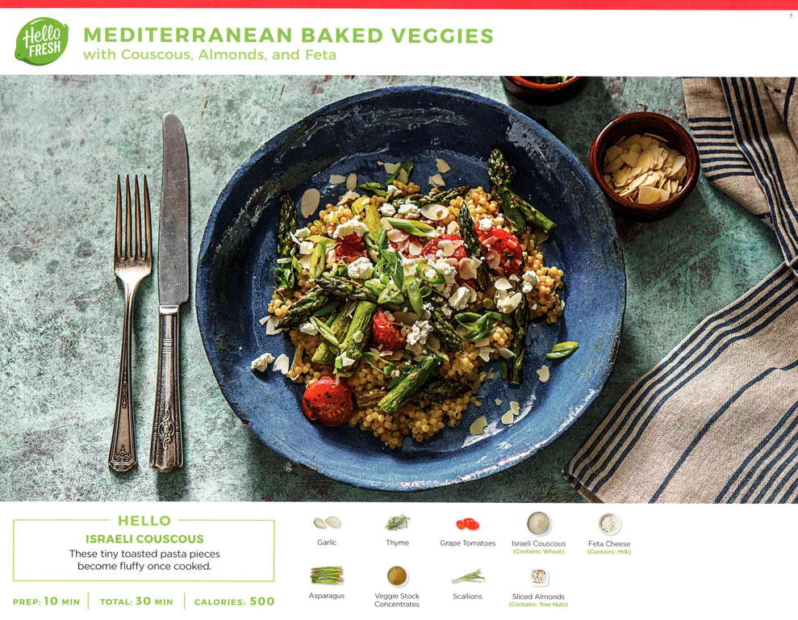
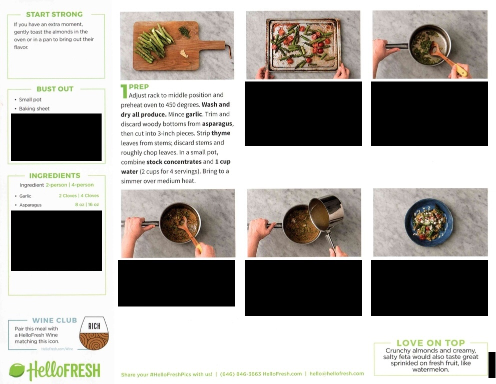
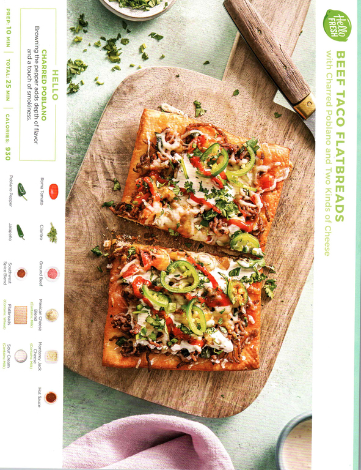
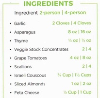

+++
title = "Digitizing Printed Recipes with ChatGPT Vision"
date = 2024-01-02T00:00:00-0700
description = ""
tags = ["python", "tesseract", "chatgpt", "ghostscript"]
+++

During the covid-19 pandemic, my wife and I were [HelloFresh](https://www.hellofresh.com/) customers - they sent us a box every week with 3 meals, and we'd make them. The box came with a two-sided 8.5x11 recipe card that looks something like the following (with a couple variations in layout over the months).

<div style="overflow-x: scroll;">
<table>
<tr><td></img></td><td></img></td></tr>
<tr><td>Front side</td><td>Back side (redacted)</td></tr>
</table>
</div>

We have 152 of these cards now, and we keep using them to make our favorites even though we don't subscribe the HelloFresh anymore.

## Scanning the Cards

I have a [Brother ADS-1700W](https://www.brother-usa.com/products/ads1700w) document scanner set up to scan a document as a 300DPI color PDF and email it to me directly with the push of a button.
It can do dual-sided scanning, and with the thickness of the HelloFresh recipes, the feeder can take around 6 pages at once reliably.
So I sat there for about 20 minutes scanning the 152 recipe cards in small batches.
I ended up with 31 PDFs with between 8 and 12 pages each (4-6 cards, front and back), since I started with 4 cards at a time and worked my way up to 6.

## Splitting the Recipes

The next step was to split the recipes in the 31 PDFs so that I had a single two-page PDF for each recipe.
The scanner puts front and back next to each other in the scanned PDF, so it was just a matter of looping through the 31 PDFs and splitting them up into pairs of pages.
I used GhostScript to do manipulate the PDFs.
The basic idea is this:

```bash
# number the output PDFs
outcount=1
for pdf_file in ...; do

    # Get the total number of pages in the PDF
    total_pages=$(gs -q -dNOSAFER -dNODISPLAY -c "($pdf_file) (r) file runpdfbegin pdfpagecount = quit")

    # Loop through the pages in steps of 2
    for ((first_page=1; first_page<=total_pages; first_page+=2)); do
        # Calculate the last page of the current pair
        last_page=$((first_page+1))
        # Output file name based on the page numbers
        output_file="$OUT_DIR/$outcount.pdf"
        # Ghostscript command to split the PDF
        gs -q -sDEVICE=pdfwrite -dNOPAUSE -dBATCH -dNOSAFER -r300 -dFirstPage=$first_page -dLastPage=$last_page -sOutputFile="$output_file" "$pdf_file"
        ((outcount++))
    done

done
```
`-dNOSAFER` seemed to be needed to read the input PDF file from disk for reasons I don't really understand.


## Rotating the Recipes

The document scanner puts the scanned pages in portrait orientation, which is 90 degrees off (either clockwise or counterclockwise) from the correct landscape orientation.
I wasn't careful when I did the original scan, so it's totally random which way the orientation is off.
(Actually, it's not *totally* random - if the first page needs to be rotated by 90 degrees, the second page needs to be rotated by 270 degrees because the second page is the back of the first page, but I didn't take advantage of this in my script.)

The scanned images will ultimately be passed to ChatGPT, which says it works best when the images are correctly rotated.
I used [Tesseract](https://github.com/tesseract-ocr/tesseract) to try to detect the orientation.
Tesseract can't directly read PDFs, so first, I used ImageMagick to convert each PDF to a raster image.


and then passed each image to Tesseract.

```bash
convert -density 300 <pdf> -quality 100 "$tmpdir"/page-%02d.jpg
```

This converts the pdf to a set of JPEG files named `page-XX.jpg`, where `XX` is the page number in the PDF file.
I provided the same DPI as the scan was done at, and set quality to 100 to reduce the amount of JPEG artifacts.
Then I passed each image to tesseract to detect the orientation.

```bash
tesseract --dpi 300 -c thresholding_method=0 <image> stdout --psm 0
```

Tesseract has three thresholding methods (0, 1, and 2).
They all generally work well, but for certain images, a certain thresholding method might fail.
So, I just ran all three methods, and had them vote on what the rotational orientation should be.
I empirically decided that an `Orientation confidence:` value of less than 3 meant that the method did not work.

```bash
# use all three thresholding methods to try to detect a rotation.
local tess0=$(tesseract --dpi 300 -c thresholding_method=0 $page_path stdout --psm 0 2>>/dev/null)
local con0=$(echo "$tess0" | grep "Orientation confidence:" | awk '{print $3}')
local rot0=$(echo "$tess0" | grep "Rotate:" | awk '{print $2}')
local tess1=$(tesseract --dpi 300 -c thresholding_method=1 $page_path stdout --psm 0 2>>/dev/null)
local con1=$(echo "$tess1" | grep "Orientation confidence:" | awk '{print $3}')
local rot1=$(echo "$tess1" | grep "Rotate:" | awk '{print $2}')
local tess2=$(tesseract --dpi 300 -c thresholding_method=2 $page_path stdout --psm 0 2>>/dev/null)
local con2=$(echo "$tess2" | grep "Orientation confidence:" | awk '{print $3}')
local rot2=$(echo "$tess2" | grep "Rotate:" | awk '{print $2}')

# if the confidence is above 3, count it as a valid vote for a rotation
votes=()
if [ $(echo "$con0 > 3" | bc) -eq 1 ]; then
    votes+=("$rot0")
else
    echo "method 0 confidence $con0 too low"
fi
if [ $(echo "$con1 > 3" | bc) -eq 1 ]; then
    votes+=("$rot1")
else
    echo "method 1 confidence $con1 too low"
fi
if [ $(echo "$con2 > 3" | bc) -eq 1 ]; then
    votes+=("$rot2")
else
    echo "method 2 confidence $con2 too low"
fi

# tally up the rotations into buckets
cnt0=0
cnt90=0
cnt180=0
cnt270=0
for vote in "${votes[@]}"; do
    if [ "$vote" == 0 ]; then
        ((cnt0++))
    elif [ "$vote" == 90 ]; then
        ((cnt90++))
    elif [ "$vote" == 180 ]; then
        ((cnt180++))
    elif [ "$vote" == 270 ]; then
        ((cnt270++))
    fi
done

# This yields whatever rotation was voted for the most, breaking ties away from 0
local rot=0
local max="$cnt0"
if [ "$cnt90" -ge "$max" ]; then
    local rot=90
    local max="$cnt90"
fi
if [ "$cnt180" -ge "$max" ]; then
    local rot=180
    local max="$cnt180"
fi
if [ "$cnt270" -ge "$max" ]; then
    local rot=270
    local max="$cnt270"
fi
```
This worked for every single image except this one, which wanted to be oriented this way:




## Converting to JSON

The final step is providing the front and back images, along with a text prompt to ChatGPT. This was my prompt:

```
Use the recipe in the images to fill this JSON template. Produce only JSON. Convert non-ascii characters to their nearest ascii equivalents.
{
    "name": "Recipe Name",
    "totalTime": "... mins",
    "calories": ...,
    "ingredients": [
        {
            "name": "ingredient 1",
            "2-person quantity": "...",
            "4-person quantity": "...",
        },
        {
            "name": "ingredient 2",
            "2-person quantity": "...",
            "4-person quantity": "...",
        }
    ]
    "instructions": [
        "step 1",
        "step 2",
        "..."
    ],
    "notes": [
        "note 1",
        "note 2"
    ]
}
```

At the time of writing, the `gpt-4-vision-preview` model operates on images that are at most 768x2000 pixels, so there is no reason to provide an image larger than that.
This is just barely large enough to make out the smallest text in the recipes:



This worked great, and resulted in output like this:

```json
{
    "name": "Apricot, Almond & Chickpea Tagine with Zucchini, Basmati Rice & Chermoula",
    "totalTime": "40 mins",
    "calories": 950,
    "ingredients": [
        {
            "name": "Yellow Onion",
            "2-person quantity": "1/2",
            "4-person quantity": "1"
        },
        {
            "name": "Garlic",
            "2-person quantity": "1 clove",
            "4-person quantity": "2 cloves"
        },
        {
            "name": "Jalapeno",
            "2-person quantity": "1",
            "4-person quantity": "1"
        },
        {
            "name": "Zucchini",
            "2-person quantity": "1/2",
            "4-person quantity": "1"
        },
        {
            "name": "Chickpeas",
            "2-person quantity": "13.4 oz",
            "4-person quantity": "26.8 oz"
        },
        {
            "name": "Vegetable Stock Concentrates",
            "2-person quantity": "2",
            "4-person quantity": "4"
        },
        {
            "name": "Sour Cream",
            "2-person quantity": "4 TBSP",
            "4-person quantity": "8 TBSP"
        },
        {
            "name": "Basmati Rice",
            "2-person quantity": "1/2 cup",
            "4-person quantity": "1 cup"
        },
        {
            "name": "Tunisian Spice Blend",
            "2-person quantity": "1 TBSP",
            "4-person quantity": "2 TBSP"
        },
        {
            "name": "Cilantro",
            "2-person quantity": "1/4 oz",
            "4-person quantity": "1/2 oz"
        },
        {
            "name": "Lemon",
            "2-person quantity": "1",
            "4-person quantity": "2"
        },
        {
            "name": "Sliced Almonds",
            "2-person quantity": "1/2 oz",
            "4-person quantity": "1 oz"
        },
        {
            "name": "Dried Apricots",
            "2-person quantity": "1 oz",
            "4-person quantity": "2 oz"
        },
        {
            "name": "Hot Sauce",
            "2-person quantity": "1 tsp",
            "4-person quantity": "1 tsp"
        }
    ],
    "instructions": [
        "Wash and dry all produce. Halve, peel, and dice onion. Mince garlic. Zest and halve lemon. Mince jalapeno, removing ribs and seeds for less heat. Trim and halve zucchini lengthwise; cut crosswise into 1/2-inch-thick half-moons. Drain and rinse chickpeas; pat dry with paper towels.",
        "Heat a drizzle of olive oil in a small pot over medium-high heat. Add 1/4 of the onion; cook, stirring, until just softened, 2-3 minutes. Stir in rice, 3/4 cup water (1 1/2 cups for 4 servings), half the stock concentrates (you'll use the rest later), and a pinch of salt. Bring to a boil, then cover and reduce to a low simmer. Cook until rice is tender, 15-18 minutes. Keep covered off heat until ready to serve.",
        "While rice cooks, in a small bowl, combine cilantro, 2 TBSP olive oil (3 TBSP for 4 servings), a pinch of garlic, salt, and pepper. Add lemon juice to taste and add more garlic if desired. In a separate small bowl, combine sour cream, a pinch of salt, and as much lemon zest as you like. Add water 1 tsp at a time until mixture reaches a drizzling consistency.",
        "Heat a large drizzle of olive oil in a large pan over medium-high heat. Add zucchini and remaining onion. Cook, stirring, until softened and lightly browned, 5-7 minutes (7-10 minutes for 4 servings). Stir in chickpeas and remaining stock concentrates. Keep cooking, stirring frequently, until chickpeas are browned and veggies are tender, 1-2 minutes.",
        "Pour 1/3 cup water (2/3 cup for 4 servings) and remaining stock concentrates into pan. Stir in Tunisian spice. Bring to a low simmer. Cook until liquid is slightly reduced, 1-2 minutes. Reduce heat to low; stir in 1 TBSP butter (2 TBSP for 4 serving). Season with salt and pepper.",
        "Fluff rice with a fork; stir in 1 TBSP butter (2 TBSP for 4 servings). Season with salt and pepper. Divide rice between plates and top with tagine, almonds, and apricots. (TIP: Toast almonds before adding if you like). Drizzle with creamy lemon sauce and chermoula. Drizzle hot sauce if desired. Cut any remaining lemon into wedges; serve on the side."
    ],
    "notes": [
        "The tip to fluff rice right before serving using a fork helps make the grain airy and light for tender results.",
        "The Tunisian spice blend could contain a mix of spices like coriander, cumin, caraway, and garlic commonly found in North African cuisine."
    ]
}
```

I used the OpenAI API, and it cost about $8 total for all 152 recipes.