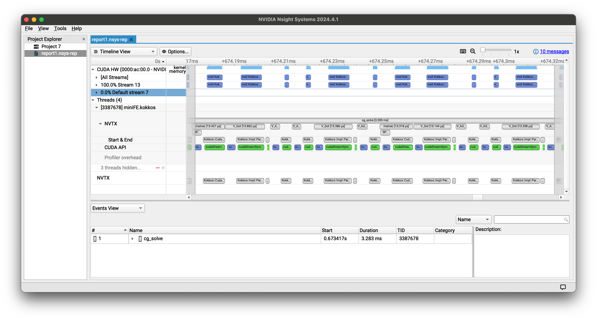

+++
title = "Using Kokkos Tools and Nsight Systems to Understand your Kokkos Application"
date = 2024-07-29T00:00:00-0700
description = "How to use nvtx-connector with Nsight Systems to understand your Kokkos codes"
tags = ["kokkos", "cmake", "nvidia", "nsight", "CUDA", "GPU", "kokkos tools"]
draft = false
+++

In my experience, even expert developers of an application can be surprised about how their program uses a GPU-enabled system.
This has only gotten harder as the size of scientific applications has ballooned and computer architectures have gotten more complex.
This blog post explore how to use Kokkos Tools' nvtx-connector and Nvidia's Nsight Systems with your CUDA-enabled Kokkos application to help you:

* visualize where your code is spending time, from kernel executions to memory transfers.
* correlate application-level events with low-level system activities for easier troubleshooting.

These tools are great for existing Kokkos application or when embarking on a new project.

## Configuring your Kokkos Build

Nsight systems is meant for applications that use Nvidia GPUs.
As long as you're using Kokkos' CUDA backend: `-DKokkos_ENABLE_CUDA=ON`, you're all set: Kokkos' profiling hooks are always enabled.

## The nvtx-connector: Bridging Kokkos and NVIDIA Nsight Systems

[Kokkos Tools](https://github.com/kokkos/kokkos-tools) is a suite of profiling and analysis tools designed to work seamlessly with Kokkos applications. It provides a powerful framework for gathering performance data and insights into your Kokkos-based code. The Kokkos Tools ecosystem includes various plugins and connectors that allow you to interface with different profiling and visualization tools, enhancing your ability to optimize Kokkos applications.
One of the key components of Kokkos Tools is the profiling API, which enables the collection of detailed performance data without requiring changes to your application code. This API is leveraged by various backends, including the nvtx-connector, which we'll focus on in this post.

The nvtx-connector is a crucial component that bridges the gap between Kokkos applications and NVIDIA's powerful profiling tools, particularly Nsight Systems. It translates Kokkos events into NVIDIA Tools Extension (NVTX) ranges, allowing you to visualize and analyze your Kokkos application's performance within the Nsight Systems interface.

## Annotating Your Application with Kokkos Profiling Regions

Kokkos will automatically add NVTX ranges for various Kokkos operations, like parallel regions and allocations.
However, you can also add ranges of your own to help you correlate Kokkos activity with application phases.
These annotations allow you to mark specific sections of your code, making it easier to identify performance bottlenecks and understand the behavior of your application at a granular level.

## How to Add Profiling Regions

Kokkos provides a pair of functions for adding profiling regions to your code.
Don't be afraid to add these calls throughout your application: if you do not have a profiling library loaded, these calls will just become a check whether a function pointer is null.
This branch is easy for the CPU to predict (because it is always true or always false), so there is no real performance cost.

Here's how you use them

```c++
void foo() {
    Kokkos::Profiling::pushRegion("your region label");

    // your code here ...

    Kokkos::Profiling::popRegion();
}
```

You can nest profiling regions

```c++
void foo() {
    Kokkos::Profiling::pushRegion("outer region");

    // some code here ...

    Kokkos::Profiling::pushRegion("inner region");

    // your code here ...

    Kokkos::Profiling::popRegion(); // ends inner region
    Kokkos::Profiling::popRegion(); // ends outer region
}
```

Care is sometimes needed to ensure that every `pushRegion` has an associated `popRegion`.

```c++
void be_careful() {
    Kokkos::Profiling::pushRegion("my region");

    if (early_return) {
        Kokkos::Profiling::popRegion(); // ends "my region"
        return;
    }

    // some code here

    Kokkos:Profiling::popRegion(); // also ends "my region"
}
```

Also, be sure you pop a region before `return`ing from a function!

```c++
void dont_do_this() {
    Kokkos::Profiling::pushRegion("my region");
    int x;

    // some code here ...

    return x;
    Kokkos::Profiling::popRegion(); // oops, region won't ever be popped!
}
```

## Collecting a Trace with Nvidia Nsight Systems

Once you've added profiling regions to your application, you're ready to run Nsight Systems.
There are two halves to Night Systems: the first does the profiling on the target platform, and the second is installed on your client to view the results. Go to Nvidia's website and look for "Download Nsight Systems for [your OS] host". There are Windows, macOS, and Linux versions. This is what you will use to view and analyze the profiling results.

The approach is essentially this:

1. Run your application on the target platform using `nsys` to generate one or more trace files.
2. Copy the produced trace file(s) to your client.
3. View and analyze the results using Nsight Systems on your client.

There are variations on this theme that I won't cover: for example, Nsight Systems can connect to a remote system to profile directly, or perhaps the client and target systems are the same.

The approach to generate the trace will be something like this
```bash
nsys profile [nsys flags] your/app [your application flags]
```

Then I usually just `scp` the resulting trace files to my client and fire up Nsight Systems. File > Open > Select your trace files.

## An example of putting it all together: miniFE

miniFE is a relatively simple, but realistic test case.

> MiniFE is an proxy application for unstructured implicit finite element codes. It is similar to HPCCG and pHPCCG but provides a much more complete vertical covering of the steps in this class of applications. MiniFE also provides support for computation on multicore nodes, including pthreads and Intel Threading Building Blocks (TBB) for homogeneous multicore and CUDA for GPUs. Like HPCCG and pHPCCG, MiniFE is intended to be the "best approximation to an unstructured implicit finite element or finite volume application, but in 8000 lines or fewer."

I added profiling regions to [my fork of miniFE](https://github.com/cwpearson/miniFE) in [this PR](https://github.com/cwpearson/miniFE/pull/11/files).

**Set up some paths for the example**
```bash
ROOT=kokkos_nsys_example
KOKKOS_SRC=$ROOT/kokkos
KOKKOS_BUILD=$KOKKOS_SRC/build
KOKKOS_INSTALL=$KOKKOS_SRC/install
TOOLS_SRC=$ROOT/kokkos-tools
TOOLS_BUILD=$ROOT/kokkos-tools/build
MINIFE_SRC=$ROOT/miniFE
MINIFE_BUILD=$MINIFE_SRC/build
```

**Compile Kokkos for CUDA**

You're probably already doing this for your application if you use Nvidia GPUs, but I include it here for completeness.
* Remember to choose a `-DKokkos_ARCH_` appropriate for your GPU

```bash
git clone --branch develop --depth 1 https://github.com/kokkos/kokkos.git "$KOKKOS_SRC"

cmake -S "$KOKKOS_SRC" -B "$KOKKOS_BUILD" \
  -DCMAKE_BUILD_TYPE=Release \
  -DCMAKE_INSTALL_PREFIX="$KOKKOS_INSTALL" \
  -DCMAKE_CXX_COMPILER=$(realpath $KOKKOS_SRC/bin/nvcc_wrapper) \
  -DKokkos_ENABLE_CUDA=ON \
  -DKokkos_ARCH_AMPERE86=ON \
  -DCMAKE_CXX_STANDARD=17 \
  -DCMAKE_CXX_EXTENSIONS=OFF

cmake --build "$KOKKOS_BUILD" --target install --parallel $(nproc)
```

**Compile the nvtx-connector**

The nvtx-connector needs to know where Kokkos is installed so it can retrieve the CUDA toolkit path.

```bash
git clone --branch develop --depth 1 https://github.com/kokkos/kokkos-tools.git "$TOOLS_SRC"

cmake -S "$TOOLS_SRC" -B "$TOOLS_BUILD" \
  -DCMAKE_BUILD_TYPE=Release \
  -DCMAKE_CXX_EXTENSIONS=OFF \
  -DKokkos_ROOT="$KOKKOS_INSTALL"

cmake --build $TOOLS_BUILD/profiling/nvtx-connector
```

**Compile miniFE**
```bash
git clone https://github.com/cwpearson/miniFE.git $MINIFE_SRC

cmake -S $MINIFE_SRC/kokkos -B $MINIFE_BUILD \
  -DCMAKE_BUILD_TYPE=Release \
  -DCMAKE_CXX_COMPILER=$(realpath $KOKKOS_SRC/bin/nvcc_wrapper) \
  -DCMAKE_CXX_STANDARD=17 \
  -DCMAKE_CXX_EXTENSIONS=OFF \
  -DKokkos_ROOT=$KOKKOS_INSTALL \
  -DMINIFE_ENABLE_MPI=OFF

cmake --build $MINIFE_BUILD
```

**Run miniFE with nsight systems**

This will create `reportX.nsys-rep`

```bash
# tell Kokkos::initialize which tools library to use
export KOKKOS_TOOLS_LIBS=$TOOLS_BUILD/profiling/nvtx-connector/libkp_nvtx_connector.so

nsys profile -f true -t cuda,nvtx $MINIFE_BUILD/miniFE.kokkos
```

If it worked, you will see a couple messages in your output

```
-----------------------------------------------------------
KokkosP: NVTX Analyzer Connector (sequence is 0, version: 20211015)
-----------------------------------------------------------
```

```
-----------------------------------------------------------
KokkosP: Finalization of NVTX Connector. Complete.
-----------------------------------------------------------
```

```
Generating '/tmp/nsys-report-e218.qdstrm'
[1/1] [========================100%] report1.nsys-rep
Generated:
    /.../report1.nsys-rep
```

## Looking at the Result

Copy the produced `report[N].nsys-rep` file from the server to the client, and open it in the client Nsight Systems.

"File" > "Open" > "report[N].nsys-rep"

[](nsys_overview.png)

This first figure is an overview of the whole miniFE execution.
The central "Timeline View" displays a timeline of GPU and CPU activities, allowing the user to visualize the execution over time.
The "CUDA HW" rows show activity on the GPU, including kernels and memory transfers.
Below that is the NVTX ranges, which are associated with Kokkos activities and the profiling ranges added to the application.
The "CUDA API" section shows what underlying CUDA API calls are made by the host.
By correlating these three sections, you can understand what Kokkos operations are associated with which CUDA and GPU activity.
Note that many Kokkos operations are asynchronous, so the GPU activity may occur *after* the Kokkos operation.

[](nsys_detail.png)

This second screenshot is zoomed in on the main conjugate-gradient loop in miniFE.
Here it's easier to see individual Kokkos parallel regions and the associated GPU activity and fences.

## Extras: MPI + nsys

Nsight Systems can also show MPI communication in the trace view.
For supported MPI operations, you can tell Nsight Systems to do so automatically:

```bash
nsys profile -t cuda,nvtx,mpi --mpi-impl=openmpi
nsys profile -t cuda,nvtx,mpi --mpi-impl=mpich
```

The other needed step is to have each MPI process generate a different trace file.
You can do this with the `-o` flag, and use `%q` to tell nsight systems to read an environment variable and put it in the output name.

```bash
nsys profile -o report_%q{OMPI_COMM_WORLD_RANK}.nsys-rep
```

## Extras: Unified Memory + nsys

If your application uses CUDA Unified Memory (`Kokkos::CudaUVMSpace`), it will almost certainly be useful to ask Nsight Systems to collect information about that as well:

```bash
nsys profile --cuda-um-cpu-page-faults=true --cuda-um-gpu-page-faults=true
```
