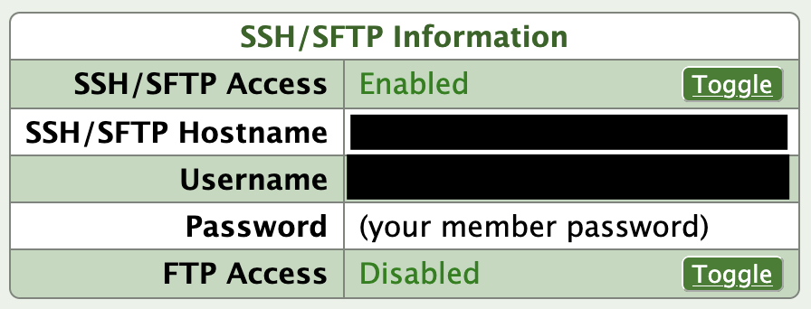
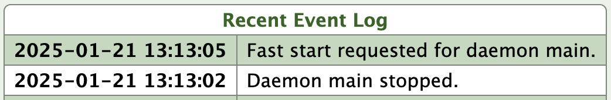

+++
title = "Automatically Deploy a Web Application to NearlyFreeSpeech.net"
date = 2025-01-22T00:00:00-0700
lastmod = 2025-01-22T00:00:00-0700
description = ""
tags = []
draft = false
+++

I've set up a repository(https://github.com/cwpearson/nfsn-example) which contains an example of how automatically deploy a Go web application to [NearlyFreeSpeech.net](https://www.nearlyfreespeech.net/).
It shows continuous deployment for a custom web server that automatically updates whenever you push changes to your repository.

## Overview

NearlyFreeSpeech.net (NFSN) is a usage-based billing web hosting service that supports both static sites and custom server applications.
This repository shows step-by-step how to:

0. Create your NFSN Site
1. Set up GitHub Actions Secrets
2. Prepare your Application
3. Creating a wrapper script for the webserver
4. Deploy the server to NearlyFreeSpeech.net
5. Configure the Daemon and Proxy

## Preprequisites

* A NearlyFreeSpeech.net account
* A GitHub repository containing your Go web application
* Basic familiarity with GitHub Actions

## 0. Create Your NFSN Site

1. Log into your NFSN account and go to the "sites" tab
2. Click "create new site"
3. Configure the following settings:
    * Short name: This will be your subdomain (https://<short name>.nfshost.com)
    * DNS: Leave blank and select "no" for "Set up DNS for new domains?"
    * Server Type: Choose "custom"
    * Site Plan: Select "Non-production" for testing (can be upgraded later)


## 1. Set Up GitHub Actions Secrets

Add these required secrets to your GitHub repository:

* `NFSN_HOSTNAME`: Your SSH/SFTP hostname from NFSN site information
* `NFSN_USERNAME`: Your NFSN site username
* `NFSN_PASSWORD`: Your NFSN account password
* `NFSN_SHORTNAME`: Your site's short name
* `BEARER_TOKEN`: A secret token for the shutdown endpoint (you choose this value)

The SSH/SFTP information can be found on the site information page for your site.



## 2. Prepare your Application

You application needs two key features:

1. NFSN provides a FreeBSD environment running on x86-64.
Go supports cross-compiling out of the box: just provide the `GOOS` and `GOARCH` environment variables.

```bash
GOOS=freebsd GOARCH=amd64 go build ./...
```

2. A protected shutdown endpoint to facilitate automatic restarts (shown here for the Echo framework)

```go
	e.POST("/shutdown", func(c echo.Context) error {
		token := c.Request().Header.Get("Authorization")
		expectedToken := "Bearer " + os.Getenv("BEARER_TOKEN")

		if token != expectedToken {
			return echo.NewHTTPError(http.StatusUnauthorized, "Invalid token")
		}

		// allow some time to send a response before app exits
		go func() {
			log.Println("Shutdown triggered via /shutdown: 5s...")
			time.Sleep(time.Second * time.Duration(5))
			os.Exit(42)
		}()

		return c.String(http.StatusOK, "shutdown in 5s\n")
	})
```

## 3. Create a Wrapper Script

Create `run.sh` to set environment variables and start your server:

Your application will probably want some environment variables set, including our `BEARER_TOKEN` to protect the shutdown endpoint.

```bash
#!/bin/sh
set -eou pipefail
export BEARER_TOKEN="$$BEARER_TOKEN"
/home/protected/app
```

## 4. Deploy to NearlyFreeSpeech.net

NearlyFreeSpeech.net doesn't have any direct integration with Github; deployment is achieved the old-fashioned way, by copying your files to the server.

Your GitHub action will:

1. Build the application binary in `protected/`
2. Create `protected/run.sh`
3. Deploy the files to NFSN using `rsync` (or `scp`, or SFTP, or ...)

```bash
sshpass -p "${{ secrets.NFSN_PASSWORD }}" \
  rsync -avz \
    -e "ssh -o StrictHostKeyChecking=no" \
    --delete protected/ "${{ secrets.NFSN_USERNAME }}"@"${{ secrets.NFSN_HOSTNAME }}":/home/protected/
```

This command makes use of some of the GitHub secrets previously described, so this information doesn't appear in the GitHub actions logs.

It moves the contents of the `protected/` directory to `/home/protected` in the NearlyFreeSpeech.net site.
It uses `sshpass` fill your password in `rsync`'s SSH authentication prompt.
Since GitHub actions are ephemeral, each time it runs, it will appear that this is the first time you've used SSH to connect to NearlyFreeSpeech.net: `-e "ssh -o StrictHostKeyChecking=no"` tells SSH to skip the prompt for you to okay the remote host key.
`--delete` causes `rsync` to delete anything in `/home/protected` that is not in `protected/`, meaning you can remove or rename your generated files, and the corresponding change will be made on the NearlyFreeSpeech.net site.

4. Terminate the running Server so NFSN Starts the New Binary

If we were just deploying static files, the next time we navigated to the site, NFSN would just serve us the updated files.
For our app, though, NFSN will still be running the old binary.

Fortunately, NFSN will try to restart our daemon command if it has exited.
So, the last thing our GitHub action does is tell the currently-running app to shut down:

```bash
curl -X POST -H "Authorization: Bearer ${{ secrets.BEARER_TOKEN }}" "https://${{ secrets.NFSN_SHORTNAME }}.nfshost.com/shutdown"
```

You'll see in the site event log that the daemon shuts down, and a few seconds later it will automatically be restarted, which launches the new binary.



## 5. Configure the Daemon and Proxy

1. Forward accesses to whatever port your app listens on

In this example, our app listens on port 8080, so we need to forward HTTP accesses to that port.

Site Information > Add a Proxy

* Protocol: HTTP
* Target Port: 8080

2: Configure the Application to Run

We need to tell NearlyFreeSpeech.net to run the app we've uploaded.

Site Information > Add Daemon

* Command: `/home/protected/run.sh`
