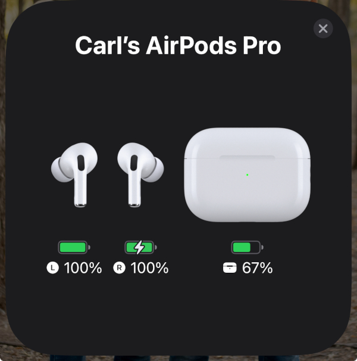
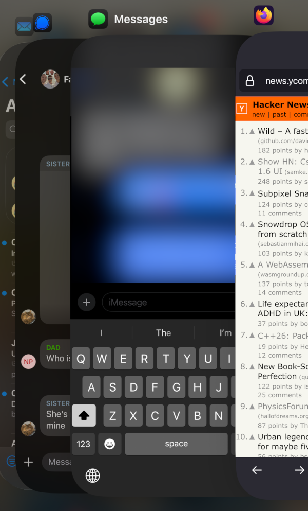
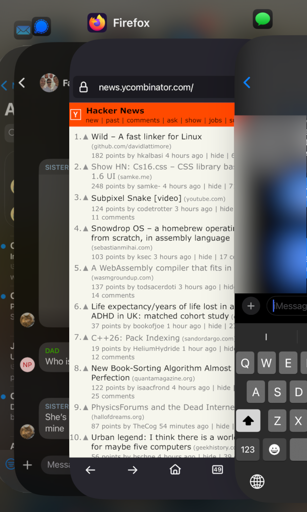
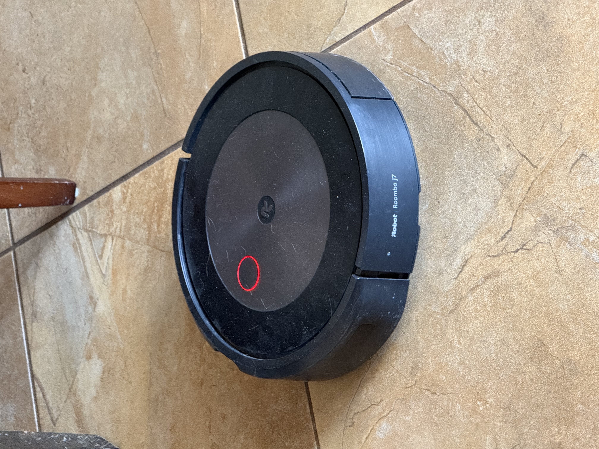
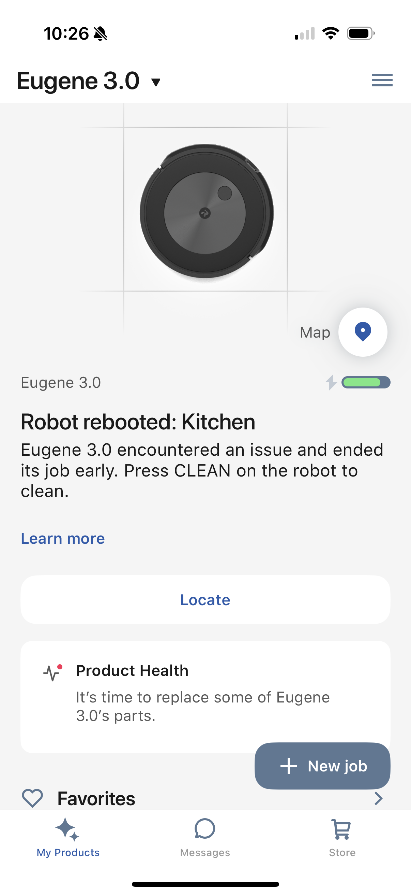
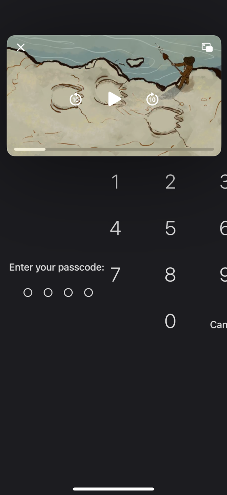

+++
title = "Some Bugs"
date = 2025-01-27T00:00:00-0700
lastmod = 2025-01-29T00:00:00-0700
description = ""
tags = ["bugs"]
draft = false
+++

I spent a few days trying to be mindful of every time I ran into an apparent software bug (outside of work!).

### January 28, 2025

The AirPods popover came up on my iPhone and I couldn't close it by tapping the "x" button.

I tapped the "skip forward" button in the Pocket Casts app, and the audio stopped and the play/pause button no longer worked. I had to restart the app to resume listening.

### January 25, 2025

When I logged into a bank online, they called me to deliver a one-time code, and the call was just 8 seconds of silence.
Then I received three automated calls with the same code in the following minutes.

### January 25. 2025

When I logged into a financial broker on my iPhone, the app immediately crashed.

### January 24 2025

The color saturation of an app in the iOS app switcher is different whether it was the last foreground app or is coming from the background

### January 23 2025

Play/pause button on iOS overlay screen didn't work.

### January 20 2025

I paused an in-progress vacuum in the iRobot app and the robot rebooted into an error state.
I had to press a button on the robot to clear that error.

### January 19 2025

I selected a URL in Firefox for iOS and couldn't edit it or drag the selection handles.

### January 18, 2025

Reddit's video element is only a few pixels high in landscape mode in Firefox for iOS.

My iPhone's unlock screen got totally mangled when I switched from landscape to portrait orientation.

### January 17, 2025

Using the Slack app for iOS to take and send a photo attached the photo to the message twice.
