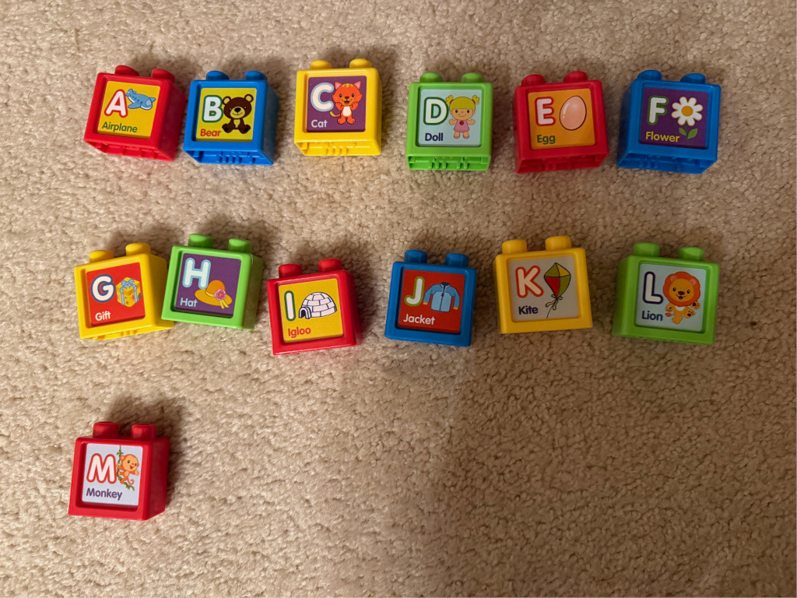
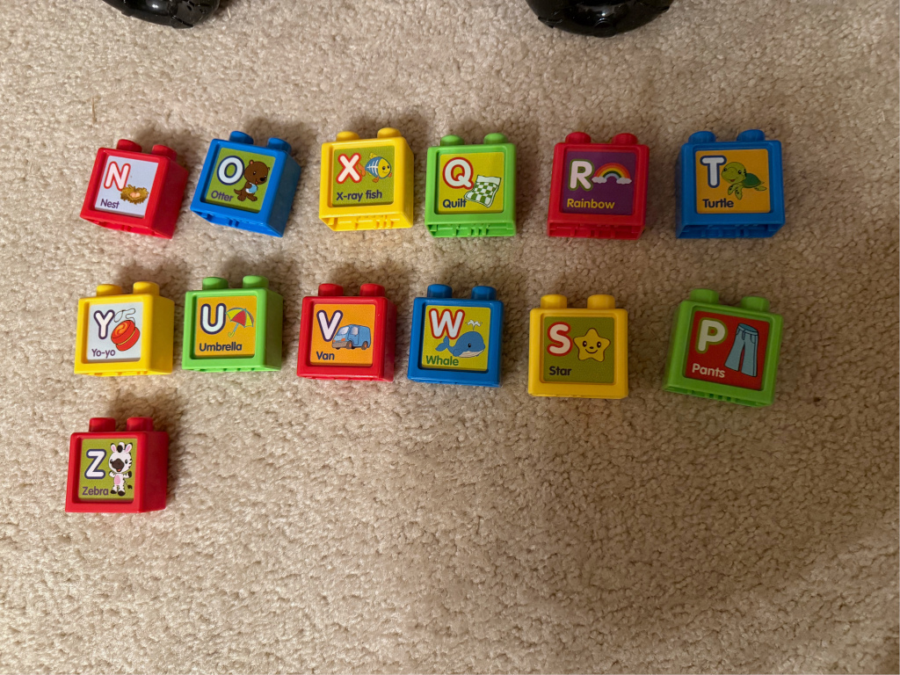

+++
title = "Heterograms in a Childrens' Toy"
date = 2025-01-30T00:00:00-0700
description = ""
tags = ["python"]
draft = false
+++

My kids have this toy that comes with some blocks.
The blocks have two sides, each with one letter. Thirteen blocks, twenty-six sides, twenty-six unique letters.
It's possible to arrange the blocks so the letters A-M (or N-Z) are all visible - i.e., each half of the alphabet is on a unique set of thirteen blocks.





Other than that, there's no apparent pattern as to which letters are paired with which, and I got to wondering what was the longest word that could be spelled:

```python
def okay(word: str) -> bool:
    for p in (
        "an",
        "bo",
        "cx",
        "dq",
        "er",
        "ft",
        "gy",
        "hu",
        "iv",
        "jw",
        "ks",
        "lp",
        "mz",
    ):
        if word.count(p[0]) + word.count(p[1]) > 1:
            return False

    return True


if __name__ == "__main__":
    with open("/usr/share/dict/words", "r") as f:
        for line in f:
            word = line.strip().lower()
            if okay(word):
                print(len(word), word)
```

```bash
python3 words.py | sort -n -s | cut -d" " -f2-
```

And the longest results:

<div style="overflow-x: scroll;">
<table>
<tr><th>Length</th><th>Word</th></tr>
<tr><td>11</td><td>customarily</td></tr>
<tr><td>11</td><td>myctophidae</td></tr>
<tr><td>11</td><td>mytilaceous</td></tr>
<tr><td>11</td><td>pseudonymic</td></tr>
<tr><td>11</td><td>symphonetic</td></tr>
<tr><td>11</td><td>windclothes</td></tr>
</table>
</div>

There are 70 words with 10 letters, including "columnwise," "jocularity," and "misexpound."

Since the longest words are not thirteen letters long, the designers obviously did not optimize the letter placement for producing the longest [heterogram](https://en.wikipedia.org/wiki/Heterogram_(literature)#13_letters).